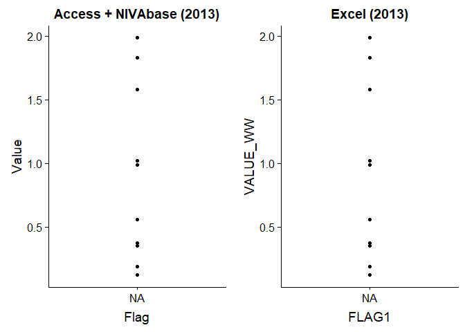
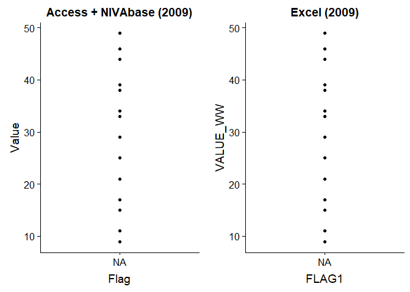
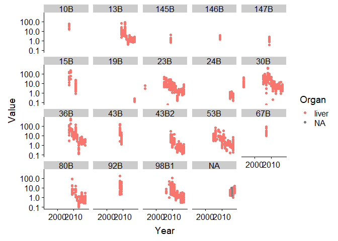
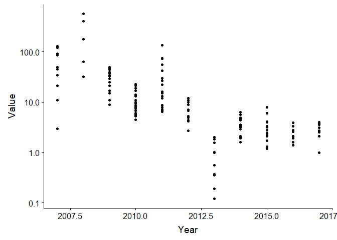
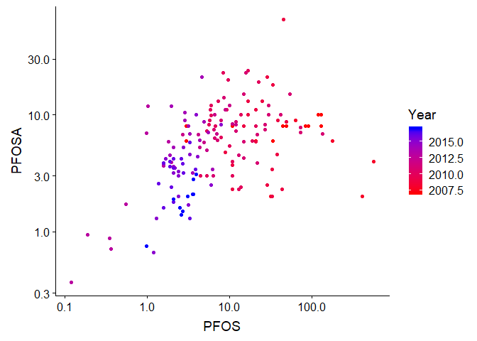

## Setup

### 1a. Libraries

```r
library(dplyr)
```

```
## 
## Attaching package: 'dplyr'
```

```
## The following objects are masked from 'package:stats':
## 
##     filter, lag
```

```
## The following objects are masked from 'package:base':
## 
##     intersect, setdiff, setequal, union
```

```r
library(niRvana)
library(ggplot2)
library(tidyr)

# install.packages("ODBC")
source("05_Add_MILKYS_data_functions.R")
```

### 1b. Set username and password

```r
# set_credentials()
```

## Data  
### Read data  
- dat: Excel data from Merete
- dat2_means: based on Excel data, species and tissua added, no less-thans (not used here)
- cemp_comb: Access data 
- data_ind2: Access data, updated with NIVAbasen data through 2017

```r
# Data from Merete (stacked data)
dat <- readxl::read_excel("Input_data/001 PFAS stacked data table.xlsx", guess_max = 11000)
```

```
## Warning in read_fun(path = path, sheet_i = sheet, limits = limits, shim =
## shim, : Expecting numeric in S58608 / R58608C19: got 'Sum'
```

```
## Warning in read_fun(path = path, sheet_i = sheet, limits = limits, shim =
## shim, : Expecting numeric in S58609 / R58609C19: got 'Sum'
```

```
## Warning in read_fun(path = path, sheet_i = sheet, limits = limits, shim =
## shim, : Expecting numeric in S58622 / R58622C19: got 'Sum'
```

```
## Warning in read_fun(path = path, sheet_i = sheet, limits = limits, shim =
## shim, : Expecting numeric in S58640 / R58640C19: got 'PF37DMOA'
```

```
## Warning in read_fun(path = path, sheet_i = sheet, limits = limits, shim =
## shim, : Expecting numeric in S58643 / R58643C19: got 'FTS, H4PFOS'
```

```
## Warning in read_fun(path = path, sheet_i = sheet, limits = limits, shim =
## shim, : Expecting numeric in S58644 / R58644C19: got 'Sum'
```

```
## Warning in read_fun(path = path, sheet_i = sheet, limits = limits, shim =
## shim, : Expecting numeric in S58646 / R58646C19: got 'Sum'
```

```
## Warning in read_fun(path = path, sheet_i = sheet, limits = limits, shim =
## shim, : Expecting numeric in S58655 / R58655C19: got 'PF37DMOA'
```

```
## Warning in read_fun(path = path, sheet_i = sheet, limits = limits, shim =
## shim, : Expecting numeric in S58659 / R58659C19: got 'FTS, H4PFOS'
```

```
## Warning in read_fun(path = path, sheet_i = sheet, limits = limits, shim =
## shim, : Expecting numeric in S58660 / R58660C19: got 'Sum'
```

```
## Warning in read_fun(path = path, sheet_i = sheet, limits = limits, shim =
## shim, : Expecting numeric in S58668 / R58668C19: got 'Sum'
```

```
## Warning in read_fun(path = path, sheet_i = sheet, limits = limits, shim =
## shim, : Expecting numeric in S58669 / R58669C19: got 'Sum'
```

```
## Warning in read_fun(path = path, sheet_i = sheet, limits = limits, shim =
## shim, : Expecting numeric in S58683 / R58683C19: got 'Sum'
```

```
## Warning in read_fun(path = path, sheet_i = sheet, limits = limits, shim =
## shim, : Expecting numeric in S58689 / R58689C19: got 'PF37DMOA'
```

```
## Warning in read_fun(path = path, sheet_i = sheet, limits = limits, shim =
## shim, : Expecting numeric in S58695 / R58695C19: got 'Sum'
```

```
## Warning in read_fun(path = path, sheet_i = sheet, limits = limits, shim =
## shim, : Expecting numeric in S58696 / R58696C19: got 'FTS, H4PFOS'
```

```
## Warning in read_fun(path = path, sheet_i = sheet, limits = limits, shim =
## shim, : Expecting numeric in S58700 / R58700C19: got 'Sum'
```

```
## Warning in read_fun(path = path, sheet_i = sheet, limits = limits, shim =
## shim, : Expecting numeric in S58701 / R58701C19: got 'Sum'
```

```
## Warning in read_fun(path = path, sheet_i = sheet, limits = limits, shim =
## shim, : Expecting numeric in S58774 / R58774C19: got 'PF37DMOA'
```

```
## Warning in read_fun(path = path, sheet_i = sheet, limits = limits, shim =
## shim, : Expecting numeric in S58785 / R58785C19: got 'FTS, H4PFOS'
```

```
## Warning in read_fun(path = path, sheet_i = sheet, limits = limits, shim =
## shim, : Expecting numeric in S58791 / R58791C19: got 'FTS, H4PFOS'
```

```
## Warning in read_fun(path = path, sheet_i = sheet, limits = limits, shim =
## shim, : Expecting numeric in S58800 / R58800C19: got 'PF37DMOA'
```

```
## Warning in read_fun(path = path, sheet_i = sheet, limits = limits, shim =
## shim, : Expecting numeric in S58810 / R58810C19: got 'PF37DMOA'
```

```
## Warning in read_fun(path = path, sheet_i = sheet, limits = limits, shim =
## shim, : Expecting numeric in S58826 / R58826C19: got 'FTS, H4PFOS'
```

```
## Warning in read_fun(path = path, sheet_i = sheet, limits = limits, shim =
## shim, : Expecting numeric in S58828 / R58828C19: got 'Sum'
```

```
## Warning in read_fun(path = path, sheet_i = sheet, limits = limits, shim =
## shim, : Expecting numeric in S58829 / R58829C19: got 'Sum'
```

```
## Warning in read_fun(path = path, sheet_i = sheet, limits = limits, shim =
## shim, : Expecting numeric in S58830 / R58830C19: got 'Sum'
```

```
## Warning in read_fun(path = path, sheet_i = sheet, limits = limits, shim =
## shim, : Expecting numeric in S58831 / R58831C19: got 'Sum'
```

```
## Warning in read_fun(path = path, sheet_i = sheet, limits = limits, shim =
## shim, : Expecting numeric in S58832 / R58832C19: got 'Sum'
```

```
## Warning in read_fun(path = path, sheet_i = sheet, limits = limits, shim =
## shim, : Expecting numeric in S58833 / R58833C19: got 'Sum'
```

```
## Warning in read_fun(path = path, sheet_i = sheet, limits = limits, shim =
## shim, : Expecting numeric in S58836 / R58836C19: got 'FTS, H4PFOS'
```

```
## Warning in read_fun(path = path, sheet_i = sheet, limits = limits, shim =
## shim, : Expecting numeric in S58840 / R58840C19: got 'PF37DMOA'
```

```
## Warning in read_fun(path = path, sheet_i = sheet, limits = limits, shim =
## shim, : Expecting numeric in S58858 / R58858C19: got 'FTS, H4PFOS'
```

```
## Warning in read_fun(path = path, sheet_i = sheet, limits = limits, shim =
## shim, : Expecting numeric in S58861 / R58861C19: got 'PF37DMOA'
```

```
## Warning in read_fun(path = path, sheet_i = sheet, limits = limits, shim =
## shim, : Expecting numeric in S58880 / R58880C19: got 'PF37DMOA'
```

```
## Warning in read_fun(path = path, sheet_i = sheet, limits = limits, shim =
## shim, : Expecting numeric in S58884 / R58884C19: got 'FTS, H4PFOS'
```

```r
# From script 05 - 'dat2_means' (duplicate-free version of 'dat2')
dat2 <- readRDS(file = "Data/04_dat2.rds")
dat2_means <- readRDS(file = "Data/04_dat2_means.rds")

# Access data
load("Input_data/Milkys_Data_2017_02_14_cemp_combinedtable.RData")  # cemp_comb
# load("Input_data/Milkys_Data_2017_02_14_cemp_tables.RData")  # cemp_c2, cemp_f2, cemp_t 

# Access data with NIVAbasen data added for 2015-2017
fn <- "../Milkys_2018/Data/12_data_ind2_2018-08-23.RData"
data_ind2 <- readRDS(fn)
```


### cemp_comb + data_ind2: Add 'param2'

```r
cemp_comb <- cemp_comb %>%
  left_join(cemp_synonyms) %>%
  mutate(param2 = ifelse(is.na(param_standard), param, param_standard)) %>%
  select(-param_standard)
```

```
## Joining, by = "param"
```

```r
cemp_comb %>%
  filter(param != param2) %>%
  count(param, param2)
```

```
## # A tibble: 10 x 3
##    param  param2     n
##    <chr>  <chr>  <int>
##  1 PFDcA  PFDA     105
##  2 PFDCA  PFDA     197
##  3 PFDcS  PFDS     105
##  4 PFDCS  PFDS     191
##  5 PFDOA  PFDoDA     6
##  6 PFDODA PFDoDA    25
##  7 PFHPA  PFHpA   1288
##  8 PFHXA  PFHxA   1287
##  9 PFHXS  PFHxS    222
## 10 PFUdA  PFUnDA   321
```

```r
data_ind2 <- data_ind2 %>%
  left_join(cemp_synonyms, by = c("PARAM" = "param")) %>%
  mutate(param2 = ifelse(is.na(param_standard), PARAM, param_standard)) %>%
  select(-param_standard)
```


### Same station/year in 4 datasets  

```r
# Access database
test_cemp <- cemp_comb %>%
  filter(jmpst %in% "36B" & myear %in% 2013 & param %in% "PFOS") 
# View(test_cemp)
test_cemp
```

```
##    myear seqno rlabo subno tissu param repno inorb vflag qflag unit basis
## 1   2013   361  NIVA     2    LI  PFOS     1     I     A  <NA>    U     W
## 2   2013   361  NIVA     4    LI  PFOS     1     I     A  <NA>    U     W
## 3   2013   361  NIVA     5    LI  PFOS     1     I     A  <NA>    U     W
## 4   2013   361  NIVA     8    LI  PFOS     1     I     A  <NA>    U     W
## 5   2013   361  NIVA     9    LI  PFOS     1     I     A  <NA>    U     W
## 6   2013   361  NIVA    11    LI  PFOS     1     I     A  <NA>    U     W
## 7   2013   361  NIVA    14    LI  PFOS     1     I     A  <NA>    U     W
## 8   2013   361  NIVA    30    LI  PFOS     1     B     A  <NA>    U     W
## 9   2013   361  NIVA    31    LI  PFOS     1     B     A  <NA>    U     W
## 10  2013   361  NIVA    32    LI  PFOS     1     B     A  <NA>    U     W
##    basis_n_distinct valsnf tiswt drywt exlip exlim tiswtx drywtx fatwtx
## 1                 1   0.12 26.12    58  46.9     D     NA  26.12   <NA>
## 2                 1   1.02 23.01    50  36.8     D     NA  23.01   <NA>
## 3                 1   0.37 22.26    54  43.5     D     NA  22.26   <NA>
## 4                 1   0.99 28.38    55  43.7     D     NA  28.38   <NA>
## 5                 1   0.35 33.50    61  50.4     D     NA  33.50   <NA>
## 6                 1   0.19 29.90    55  43.9     D     NA  29.90   <NA>
## 7                 1   0.56 28.70    59  42.0     D     NA  28.70   <NA>
## 8                 1   1.58 12.22    47  36.7     D  85.55     NA   <NA>
## 9                 1   1.83 16.75    47  33.0     D 117.30     NA   <NA>
## 10                1   1.99 15.11    47  34.1     D 105.80     NA   <NA>
##    gmlim Liver_yellow Liver_brown Liver_red Liver_white Liver_grey
## 1   <NA>            1           0         0           1          0
## 2   <NA>            0           0         1           0          0
## 3   <NA>            0           0         1           1          0
## 4   <NA>            0           0         1           1          0
## 5   <NA>            0           0         1           1          0
## 6   <NA>            0           0         1           1          0
## 7   <NA>            0           0         1           1          0
## 8   <NA>            0           0         0           0          0
## 9   <NA>            0           0         0           0          0
## 10  <NA>            0           0         0           0          0
##    Liver_green Liver_pink  Liver_color lnmin lnmax  lnmea lnstd wtmin
## 1            0          0 yellow-white    NA    NA 410.00    NA    NA
## 2            0          0          red    NA    NA 435.00    NA    NA
## 3            0          0    red-white    NA    NA 415.00    NA    NA
## 4            0          0    red-white    NA    NA 430.00    NA    NA
## 5            0          0    red-white    NA    NA 435.00    NA    NA
## 6            0          0    red-white    NA    NA 440.00    NA    NA
## 7            0          0    red-white    NA    NA 430.00    NA    NA
## 8            0          0                405   460 434.28 19.02   658
## 9            0          0                415   440 424.28  7.86   703
## 10           0          0                380   455 421.42 25.28   553
##    wtmax  wtmea  wtstd sexco agmin agmax agmea gonwt shlwt agdet shlwtx
## 1     NA 739.00     NA     M    NA    NA  2.00    NA    NA     O     NA
## 2     NA 814.00     NA     F    NA    NA  2.00    NA    NA     O     NA
## 3     NA 723.00     NA     M    NA    NA  2.00    NA    NA     O     NA
## 4     NA 822.00     NA     F    NA    NA  2.00    NA    NA     O     NA
## 5     NA 877.00     NA     F    NA    NA  2.00    NA    NA     O     NA
## 6     NA 934.00     NA     M    NA    NA  3.00    NA    NA     O     NA
## 7     NA 887.00     NA     F    NA    NA  2.00    NA    NA     O     NA
## 8    909 798.42  84.72     X     2     4  2.42    NA    NA     O     NA
## 9    905 800.71  73.98     X    NA    NA    NA    NA    NA  <NA>     NA
## 10  1013 762.28 142.04     X    NA    NA    NA    NA    NA  <NA>     NA
##    imposex_sh imposex_pe imposex_stage jmpst    speci    sdate lnmea2
## 1          NA         NA            NA   36B GADU MOR 20130901 410.00
## 2          NA         NA            NA   36B GADU MOR 20130901 435.00
## 3          NA         NA            NA   36B GADU MOR 20130901 415.00
## 4          NA         NA            NA   36B GADU MOR 20130901 430.00
## 5          NA         NA            NA   36B GADU MOR 20130901 435.00
## 6          NA         NA            NA   36B GADU MOR 20130901 440.00
## 7          NA         NA            NA   36B GADU MOR 20130901 430.00
## 8          NA         NA            NA   36B GADU MOR 20130901 434.28
## 9          NA         NA            NA   36B GADU MOR 20130901 424.28
## 10         NA         NA            NA   36B GADU MOR 20130901 421.42
##    Cryptocotyle_lingua Anisakis Ulceration Caligiform param2
## 1                FALSE    FALSE      FALSE      FALSE   PFOS
## 2                FALSE    FALSE      FALSE      FALSE   PFOS
## 3                FALSE    FALSE      FALSE      FALSE   PFOS
## 4                FALSE    FALSE      FALSE      FALSE   PFOS
## 5                FALSE    FALSE      FALSE      FALSE   PFOS
## 6                FALSE    FALSE      FALSE      FALSE   PFOS
## 7                FALSE    FALSE      FALSE      FALSE   PFOS
## 8                FALSE    FALSE      FALSE      FALSE   PFOS
## 9                FALSE    FALSE      FALSE      FALSE   PFOS
## 10               FALSE    FALSE      FALSE      FALSE   PFOS
```

```r
# Access + NIVAbasen database
test_cemp2 <- data_ind2 %>%
  filter(STATION_CODE %in% "36B" & MYEAR %in% 2013 & param2 %in% "PFOS") 
# View(test_cemp2)
test_cemp2
```

```
##    MYEAR STATION_CODE   LATIN_NAME TISSUE_NAME SAMPLE_NO2 BASIS UNIT PARAM
## 1   2013          36B Gadus morhua       Lever          2     W    U  PFOS
## 2   2013          36B Gadus morhua       Lever          4     W    U  PFOS
## 3   2013          36B Gadus morhua       Lever          5     W    U  PFOS
## 4   2013          36B Gadus morhua       Lever          8     W    U  PFOS
## 5   2013          36B Gadus morhua       Lever          9     W    U  PFOS
## 6   2013          36B Gadus morhua       Lever         11     W    U  PFOS
## 7   2013          36B Gadus morhua       Lever         14     W    U  PFOS
## 8   2013          36B Gadus morhua       Lever         19     W    U  PFOS
## 9   2013          36B Gadus morhua       Lever         20     W    U  PFOS
## 10  2013          36B Gadus morhua       Lever         21     W    U  PFOS
##    DRYWT FAT_PERC  LNMEA FLAG1 VALUE_WW  VALUE_DW  VALUE_FB   VALUE_WWa
## 1     58     46.9 410.00  <NA>     0.12 0.2068966 0.2558635 -0.11513693
## 2     50     36.8 435.00  <NA>     1.02 2.0400000 2.7717391  0.70387502
## 3     54     43.5 415.00  <NA>     0.37 0.6851852 0.8505747  0.09664049
## 4     55     43.7 430.00  <NA>     0.99 1.8000000 2.2654462  0.65673779
## 5     61     50.4 435.00  <NA>     0.35 0.5737705 0.6944444  0.13872836
## 6     55     43.9 440.00  <NA>     0.19 0.3454545 0.4328018  0.01699541
## 7     59     42.0 430.00  <NA>     0.56 0.9491525 1.3333333  0.29874922
## 8     47     36.7 434.28  <NA>     1.58 3.3617021 4.3051771  1.17213762
## 9     47     33.0 424.28  <NA>     1.83 3.8936170 5.5454545  1.32104061
## 10    47     34.1 421.42  <NA>     1.99 4.2340426 5.8357771  1.43397039
##      VALUE_DWa   VALUE_FBa param2
## 1  -0.07833889 -0.06035376   PFOS
## 2   1.50208604  2.05884509   PFOS
## 3   0.30633432  0.40710767   PFOS
## 4   1.27028928  1.60591106   PFOS
## 5   0.29529907  0.37417856   PFOS
## 6   0.12409541  0.18086634   PFOS
## 7   0.58040719  0.86206072   PFOS
## 8   2.58218383  3.29247622   PFOS
## 9   2.90041545  4.12802647   PFOS
## 10  3.13615685  4.30633957   PFOS
```

```r
#
# Commented out in order to 
#
# Database (WILAB)
# test_wilab <- get_nivabase_data("select * from WILAB.TEST where TESTNO like '2013-02901'")
# test_wilab %>% select(TESTNO, SERIALNO, MARKING, DESCRIPT, X5, X9)

# Excel data
sel <- with(dat, substr(LIMS,4,7) == "2013" & Species %in% "Gadus morhua" & Description %in% "36B" & PFAS %in% "PFOS")
sum(sel)
```

```
## [1] 10
```

```r
# View(dat[sel, ])
dat[sel,] %>% select(Description, Project, LIMS, Matrix_orig, Matrix, Species, Organ_orig, Organ, Label_original, PFAS, Data)
```

```
## # A tibble: 10 x 11
##    Description Project LIMS  Matrix_orig Matrix Species Organ_orig Organ
##    <chr>       <chr>   <chr> <chr>       <chr>  <chr>   <chr>      <chr>
##  1 36B         MilKys  NR-2~ Biota       biota  Gadus ~ <NA>       <NA> 
##  2 36B         MilKys  NR-2~ Biota       biota  Gadus ~ <NA>       <NA> 
##  3 36B         MilKys  NR-2~ Biota       biota  Gadus ~ <NA>       <NA> 
##  4 36B         MilKys  NR-2~ Biota       biota  Gadus ~ <NA>       <NA> 
##  5 36B         MilKys  NR-2~ Biota       biota  Gadus ~ <NA>       <NA> 
##  6 36B         MilKys  NR-2~ Biota       biota  Gadus ~ <NA>       <NA> 
##  7 36B         MilKys  NR-2~ Biota       biota  Gadus ~ <NA>       <NA> 
##  8 36B         MilKys  NR-2~ Biota       biota  Gadus ~ <NA>       <NA> 
##  9 36B         MilKys  NR-2~ Biota       biota  Gadus ~ <NA>       <NA> 
## 10 36B         MilKys  NR-2~ Biota       biota  Gadus ~ <NA>       <NA> 
## # ... with 3 more variables: Label_original <chr>, PFAS <chr>, Data <chr>
```


### Number of PFAS params  
For the example station/year

```r
cat("Excel data:\n")
```

```
## Excel data:
```

```r
dat %>%
  filter(substr(LIMS,4,7) == "2013" & Species %in% "Gadus morhua" & Description %in% "36B") %>%
  pull(PFAS) %>%
  unique() %>% sort()
```

```
##  [1] "PFBS"   "PFDA"   "PFDS"   "PFHpA"  "PFHxA"  "PFHxS"  "PFNA"  
##  [8] "PFOA"   "PFOS"   "PFOSA"  "PFUnDA"
```

```r
# Access
df <- cemp_comb %>%
  filter(jmpst %in% "36B" & myear %in% 2013 & substr(param,1,2) == "PF")
cat("\nAccess, new names:\n")
```

```
## 
## Access, new names:
```

```r
df %>%
  pull(param2) %>%
  unique() %>% sort()
```

```
##  [1] "PFBS"   "PFDA"   "PFDS"   "PFHpA"  "PFHxA"  "PFHxS"  "PFNA"  
##  [8] "PFOA"   "PFOS"   "PFOSA"  "PFUnDA"
```

```r
cat("\nAccess, old names:\n")
```

```
## 
## Access, old names:
```

```r
df %>%
  pull(param) %>%
  unique() %>% sort()
```

```
##  [1] "PFBS"  "PFDCA" "PFDCS" "PFHPA" "PFHXA" "PFHXS" "PFNA"  "PFOA" 
##  [9] "PFOS"  "PFOSA" "PFUdA"
```

```r
# Access + NIVAbasen
df <- data_ind2 %>%
  filter(STATION_CODE %in% "36B" & MYEAR %in% 2013 & substr(param2,1,2) %in% "PF") 
cat("\nAccess + NIVAbasen, new names:\n")
```

```
## 
## Access + NIVAbasen, new names:
```

```r
df %>%
  pull(param2) %>%
  unique() %>% sort()
```

```
##  [1] "PFAS"   "PFBS"   "PFDA"   "PFDS"   "PFHpA"  "PFHxA"  "PFHxS" 
##  [8] "PFNA"   "PFOA"   "PFOS"   "PFOSA"  "PFUnDA"
```

```r
cat("\nAccess + NIVAbasen, old names:\n")
```

```
## 
## Access + NIVAbasen, old names:
```

```r
df %>%
  pull(PARAM) %>%
  unique() %>% sort()
```

```
##  [1] "PFAS"  "PFBS"  "PFDcA" "PFDCS" "PFHpA" "PFHxA" "PFHxS" "PFNA" 
##  [9] "PFOA"  "PFOS"  "PFOSA" "PFUdA"
```


### Number of PFAS params 2
For a different station/year (Sørfjorden)

```r
cat("Excel data:\n")
```

```
## Excel data:
```

```r
dat %>%
  filter(substr(LIMS,4,7) == "2009" & Species %in% "Gadus morhua" & Description %in% "23B") %>%
  pull(PFAS) %>%
  unique() %>% sort()
```

```
## [1] "PFBS"  "PFHpA" "PFHxA" "PFNA"  "PFOA"  "PFOS"  "PFOSA"
```

```r
# Access
df <- cemp_comb %>%
  filter(jmpst %in% "23B" & myear %in% 2009 & substr(param,1,2) == "PF")
cat("\nAccess, new names:\n")
```

```
## 
## Access, new names:
```

```r
df %>%
  pull(param2) %>%
  unique() %>% sort()
```

```
## [1] "PFBS"  "PFHpA" "PFHxA" "PFNA"  "PFOA"  "PFOS"  "PFOSA"
```

```r
cat("\nAccess, old names:\n")
```

```
## 
## Access, old names:
```

```r
df %>%
  pull(param) %>%
  unique() %>% sort()
```

```
## [1] "PFBS"  "PFHPA" "PFHXA" "PFNA"  "PFOA"  "PFOS"  "PFOSA"
```

### Recreate cemp_synonyms and use it   
Used only while refining cemp_synonyms (in the ...functions file)

```r
# source("05_Add_MILKYS_data_functions.R")
# load("Input_data/Milkys_Data_2017_02_14_cemp_combinedtable.RData")  # cemp_comb
# cemp_comb <- cemp_comb %>%
#   left_join(cemp_synonyms) %>%
#   mutate(param2 = ifelse(is.na(param_standard), param, param_standard)) %>%
#   select(-param_standard)
```
## 11 most common parameters in cod
### Excel data

```r
# cat("Excel data:\n")
df <- dat %>%
  filter(Year <= 2014 & Species %in% "Gadus morhua") %>%
  count(PFAS) %>%
  filter(n > 10) %>%
  arrange(PFAS)
df %>% pull(PFAS)
```

```
##  [1] "PFBS"   "PFDA"   "PFDS"   "PFHpA"  "PFHxA"  "PFHxS"  "PFNA"  
##  [8] "PFOA"   "PFOS"   "PFOSA"  "PFUnDA"
```

```r
# "PFBS"   "PFDA"   "PFDS"   "PFHpA"  "PFHxA"  "PFHxS"  "PFNA"   "PFOA"   "PFOS"   "PFOSA"  "PFUnDA" - the 11 most common ones
# And the same as in CEMP
df
```

```
## # A tibble: 11 x 2
##    PFAS       n
##    <chr>  <int>
##  1 PFBS     823
##  2 PFDA     362
##  3 PFDS     363
##  4 PFHpA    823
##  5 PFHxA    823
##  6 PFHxS    363
##  7 PFNA     823
##  8 PFOA     797
##  9 PFOS     823
## 10 PFOSA    809
## 11 PFUnDA   362
```

### Access

```r
df <- cemp_comb %>%
  filter(myear <= 2014 & grepl("^PF", param2) & speci == "GADU MOR") %>%
  count(param2) %>%
  filter(n > 50) %>%
  arrange(param2)
df %>% pull(param2)
```

```
##  [1] "PFBS"   "PFDA"   "PFDS"   "PFHpA"  "PFHxA"  "PFHxS"  "PFNA"  
##  [8] "PFOA"   "PFOS"   "PFOSA"  "PFUnDA"
```

```r
df
```

```
## # A tibble: 11 x 2
##    param2     n
##    <chr>  <int>
##  1 PFBS    1386
##  2 PFDA     320
##  3 PFDS     320
##  4 PFHpA   1386
##  5 PFHxA   1385
##  6 PFHxS    320
##  7 PFNA    1386
##  8 PFOA    1386
##  9 PFOS    1386
## 10 PFOSA   1249
## 11 PFUnDA   320
```

```r
# "PFBS"   "PFDA"   "PFDS"   "PFHpA"  "PFHxA"  "PFHxS"  "PFNA"   "PFOA"   "PFOS"   "PFOSA"  "PFUnDA" - the 11 most common ones
```


## The less used parameters in cod
### Excel data

```r
# cat("Excel data:\n")
df <- dat %>%
  filter(Year <= 2014 & Species %in% "Gadus morhua") %>%
  count(PFAS) %>%
  filter(n < 10) %>%
  arrange(PFAS)
df %>% pull(PFAS)
```

```
##  [1] "10:2 FTOH" "12:2 FTOH" "4:2 FTOH"  "6:2 FTOH"  "6:2 FTS"  
##  [6] "8:2 FTOH"  "8:2 FTS"   "N-EtFOSA"  "N-EtFOSE"  "N-MeFOSA" 
## [11] "N-MeFOSE"  "PFBA"      "PFDoDA"    "PFDoS"     "PFHpS"    
## [16] "PFNS"      "PFPA"      "PFPeS"     "PFPS"      "PFTeDA"   
## [21] "PFTeS"     "PFTrDA"    "PFTrS"     "PFUnS"
```

```r
# "10:2 FTOH" "12:2 FTOH" "4:2 FTOH"  "6:2 FTOH"  "6:2 FTS"   "8:2 FTOH"  "8:2 FTS"   "N-EtFOSA"  "N-EtFOSE"  "N-MeFOSA" 
# "N-MeFOSE"  "PFBA"      "PFDoDA"    "PFDoS"     "PFHpS"     "PFNS"      "PFPA"      "PFPeS"     "PFPS"      "PFTeDA"   
# "PFTeS"     "PFTrDA"    "PFTrS"     "PFUnS"
df
```

```
## # A tibble: 24 x 2
##    PFAS          n
##    <chr>     <int>
##  1 10:2 FTOH     3
##  2 12:2 FTOH     3
##  3 4:2 FTOH      3
##  4 6:2 FTOH      3
##  5 6:2 FTS       3
##  6 8:2 FTOH      3
##  7 8:2 FTS       3
##  8 N-EtFOSA      3
##  9 N-EtFOSE      3
## 10 N-MeFOSA      3
## # ... with 14 more rows
```


### Access

```r
df <- cemp_comb %>%
  filter(myear <= 2014 & grepl("^PF", param2) & speci == "GADU MOR") %>%
  count(param2) %>%
  filter(n <= 50) %>%
  arrange(param2)
df %>% pull(param2)
```

```
## [1] "PFBA"   "PFDoDA" "PFHXDA" "PFODA"  "PFPeA"  "PFTeDA" "PFTrDA"
```

```r
# Here:            "PFBA"   "PFDoDA" "PFHXDA" "PFODA"  "PFPeA"  "PFTeDA" "PFTrDA"
# In Excel data:     x         x                                   x        x
df
```

```
## # A tibble: 7 x 2
##   param2     n
##   <chr>  <int>
## 1 PFBA      25
## 2 PFDoDA    25
## 3 PFHXDA    25
## 4 PFODA     25
## 5 PFPeA     25
## 6 PFTeDA    25
## 7 PFTrDA    25
```

## Number of observations, cod (PFOS obs per year)
### Excel data

```r
# cat("Excel data:\n")
dat %>%
  filter(Year <= 2014 & Species %in% "Gadus morhua" & PFAS == "PFOS" & Description == "23B") %>%
  count(Year)
```

```
## # A tibble: 10 x 2
##     Year     n
##    <dbl> <int>
##  1  1993     1
##  2  2005     1
##  3  2006     2
##  4  2007     1
##  5  2009    21
##  6  2010    20
##  7  2011     8
##  8  2012    11
##  9  2013    16
## 10  2014    14
```

### Access  
The number of observations in Access is much higher and makes much more sense

```r
cemp_comb %>%
  filter(myear <= 2014 & speci == "GADU MOR" & param2 %in% "PFOS" & jmpst %in% "23B") %>%
  count(myear)
```

```
## # A tibble: 11 x 2
##    myear     n
##    <int> <int>
##  1  1993     8
##  2  2005    18
##  3  2006    20
##  4  2007    23
##  5  2008    25
##  6  2009    25
##  7  2010    25
##  8  2011    25
##  9  2012    11
## 10  2013    15
## 11  2014    14
```

## Stations, cod (PFOS as example)
### Excel data

```r
# cat("Excel data:\n")
dat %>%
  filter(Year <= 2014 & Species %in% "Gadus morhua" & PFAS == "PFOS") %>%
  count(Description)
```

```
## # A tibble: 15 x 2
##    Description     n
##    <chr>       <int>
##  1 10B             3
##  2 13B            34
##  3 13BH           65
##  4 15B            25
##  5 23B            95
##  6 30B           112
##  7 36A             1
##  8 36B           104
##  9 43B            21
## 10 43B2           80
## 11 53B            76
## 12 67B             1
## 13 80B            77
## 14 92B            49
## 15 98B1           80
```

### Access  
The same stations, but lacking '13BH' and with 145B, 146B and 147B in addition

```r
cemp_comb %>%
  filter(myear <= 2014 & speci == "GADU MOR" & param2 %in% "PFOS") %>%
  count(jmpst)
```

```
## # A tibble: 16 x 2
##    jmpst     n
##    <chr> <int>
##  1 10B      19
##  2 13B     106
##  3 145B     11
##  4 146B     25
##  5 147B     25
##  6 15B      45
##  7 23B     209
##  8 30B     212
##  9 36B     127
## 10 43B      41
## 11 43B2    120
## 12 53B     176
## 13 67B      15
## 14 80B      81
## 15 92B      50
## 16 98B1    124
```

## Number of observations, blue mussel (PFOS obs per year)
### Excel data  
Extremely few observations up until 2014 (and not so many thereafter)  

```r
# dat %>%
#   count(Species)
dat %>%
  filter(Year <= 2014 & Species %in% "Blåskjell" & PFAS == "PFOS") %>%
  count(Description, Year)
```

```
## # A tibble: 9 x 3
##   Description  Year     n
##   <chr>       <dbl> <int>
## 1 <NA>         2013     3
## 2 <NA>         2014     3
## 3 22A          2007     1
## 4 23B          2011     1
## 5 30A          2007     1
## 6 30B          2011     7
## 7 36A          2006     1
## 8 71A          2006     3
## 9 I301         2007     1
```

### Access  
Even fewer observations  

```r
cemp_comb %>%
  filter(speci == "MYTI EDU" & param2 %in% "PFOS") %>%
  count(speci, jmpst, myear)
```

```
## # A tibble: 6 x 4
##   speci    jmpst myear     n
##   <chr>    <chr> <int> <int>
## 1 MYTI EDU 35A    2015     1
## 2 MYTI EDU B11    2015     1
## 3 MYTI EDU B2     2015     1
## 4 MYTI EDU B3     2015     1
## 5 MYTI EDU B4     2015     1
## 6 MYTI EDU B5     2015     1
```

```r
# cat("Excel data:\n")
```
## Make ready for making new version of data set  
- Delete MilKys cod through 2017, and replace those data with cod data from Access   
- Only 
- Also add new columns for fat, dry weight,length, weight   

### Counts

```r
data_ind2 %>% filter(LATIN_NAME %in% "Gadus morhua" & param2 %in% "PFOS") %>% nrow()
```

```
## [1] 1705
```

```r
dat2_means %>% filter(Species %in% "Gadus morhua" & PFAS %in% "PFOS") %>% nrow()
```

```
## [1] 1230
```

### Tissues
Lever only  

```r
dat2 %>% 
  filter(Project %in% "MilKys") %>%
  count(Project, Species, Organ)
```

```
## # A tibble: 12 x 4
##    Project Species                    Organ          n
##    <chr>   <chr>                      <chr>      <int>
##  1 MilKys  Blåskjell                  <NA>         212
##  2 MilKys  Blåskjell                  whole body   408
##  3 MilKys  Gadus morhua               <NA>        7249
##  4 MilKys  Gadus morhua               liver       4553
##  5 MilKys  Lepidorhombus whiffiagonis <NA>         210
##  6 MilKys  Limanda limanda            <NA>          91
##  7 MilKys  Littorina littorea         <NA>           7
##  8 MilKys  Nucella lapillus           <NA>          14
##  9 MilKys  Platichthys flesus         <NA>         140
## 10 MilKys  Pleuronectes platessa      <NA>         133
## 11 MilKys  Somateria mollissima       blood        150
## 12 MilKys  Somateria mollissima       egg          150
```

```r
data_ind2 %>% 
  filter(LATIN_NAME %in% c("Gadus morhua", "Platichthys flesus", "Limanda limanda")) %>%
  filter(grepl("^PF", PARAM)) %>%
  count(LATIN_NAME, TISSUE_NAME) # %>% pull(TISSUE_NAME)
```

```
## # A tibble: 1 x 3
##   LATIN_NAME   TISSUE_NAME     n
##   <chr>        <chr>       <int>
## 1 Gadus morhua Lever       16084
```

### Units 1
Access data = U, NIVAbasen = UG_P_KG, Excel = ng/g  
We test below that they are the same  

```r
data_ind2 %>%
  filter(LATIN_NAME %in% "Gadus morhua" & param2 %in% "PFOS") %>%
  xtabs(~MYEAR + UNIT, .)
```

```
##       UNIT
## MYEAR    U UG_P_KG
##   1993  16       0
##   2005  57       0
##   2006  80       0
##   2007 115       0
##   2008 107       0
##   2009 280       0
##   2010 162       0
##   2011 202       0
##   2012  87       0
##   2013 102       0
##   2014 105       0
##   2015   0     128
##   2016   0     131
##   2017   0     133
```

```r
dat %>%
  filter(Species %in% "Gadus morhua" & PFAS %in% "PFOS") %>%
  count(Unit)
```

```
## # A tibble: 1 x 2
##   Unit      n
##   <chr> <int>
## 1 ng/g   1275
```
### Units 2 - test using plot (2013)  
Unit UG_P_KG in Access + NIVAbase, vs ng/g for Excel  

```r
# Access + NIVAbasen database
library(cowplot)
```

```
## 
## Attaching package: 'cowplot'
```

```
## The following object is masked from 'package:ggplot2':
## 
##     ggsave
```

```r
test1 <- dat %>%
  filter(Year == "2013" & Species %in% "Gadus morhua" & Description %in% "36B" & PFAS %in% "PFOS") %>%
  mutate(Value = as.numeric(sub("<","", Data)),
         Flag = ifelse(grepl("<", Data), "<", as.character(NA)))
gg1 <- ggplot(test1, aes(x = Flag, y = Value)) + 
  geom_point() +
  labs(title = "Access + NIVAbase (2013)")

# par(mfrow = c(1,2), mar = c(4,5,2,1))
# plot(test1$Value)

# Excel data

test2 <- data_ind2 %>%
  filter(STATION_CODE %in% "36B" & MYEAR %in% 2013 & param2 %in% "PFOS") 
gg2 <- ggplot(test2, aes(x = FLAG1, y = VALUE_WW)) + 
  geom_point() + 
  labs(title = "Excel (2013)")

plot_grid(gg1, gg2, ncol = 2)
```

<!-- -->

### Units 3 - test using plot (2009)
Unit U in Access + NIVAbase, vs ng/g for Excel  

```r
# Access + NIVAbasen database
library(cowplot)

test1 <- dat %>%
  filter(Year == "2009" & Species %in% "Gadus morhua" & Description %in% "36B" & PFAS %in% "PFOS") %>%
  mutate(Value = as.numeric(sub("<","", Data)),
         Flag = ifelse(grepl("<", Data), "<", as.character(NA)))
gg1 <- ggplot(test1, aes(x = Flag, y = Value)) + 
  geom_point() +
  labs(title = "Access + NIVAbase (2009)")

# par(mfrow = c(1,2), mar = c(4,5,2,1))
# plot(test1$Value)

# Excel data

test2 <- data_ind2 %>%
  filter(STATION_CODE %in% "36B" & MYEAR %in% 2009 & param2 %in% "PFOS") 
gg2 <- ggplot(test2, aes(x = FLAG1, y = VALUE_WW)) + 
  geom_point() + 
  labs(title = "Excel (2009)")

plot_grid(gg1, gg2, ncol = 2)
```

<!-- -->
## Make new version of data set (dat2)

### Make data set 'dat_withoutcod' by deleting the cod data  
Ans also adding Value amd Flag as well as dryweight, fat percent and 

```r
# 
dat_withoutcod <- dat %>%
  filter(!(Species %in% "Gadus morhua" & Project %in% "MilKys")) %>%  # Remove MilKys fish
  mutate(Value = as.numeric(sub("<","", Data)),                     # Make Value from Data
         Flag = ifelse(grepl("<", Data), "<", as.character(NA)),    # Make Flag (less-than sign)
         Drywt = as.numeric(NA),
         Fatperc = as.numeric(NA),
         Length = as.numeric(NA))

nrow(dat)
```

```
## [1] 59574
```

```r
nrow(dat_withoutcod)
```

```
## [1] 47772
```

### Make data for adding  
Note that we "construct" new values for "LIMS" on a completely different format, as this is needed to 
identify individuals. These new identifiers (starting with "Nivabase_") have no connection to LIMS.  

```r
params <- c(
  "PFBS", "PFDA", "PFDS", "PFHpA", "PFHxA", "PFHxS", "PFNA", "PFOA", "PFOS", "PFOSA", "PFUnDA",
  "PFBA", "PFDoDA", "PFHXDA", "PFODA", "PFPeA", "PFTeDA", "PFTrDA"
  )

data_to_add <- data_ind2 %>%
  filter(LATIN_NAME %in% "Gadus morhua") %>%
  filter(param2 %in% params) %>%
  rename(
    Year = MYEAR,
    Description = STATION_CODE,
    Species = LATIN_NAME,
    Organ = TISSUE_NAME,
    PFAS = param2,
    Value = VALUE_WW,
    Flag = FLAG1,
    Drywt = DRYWT,
    Fatperc = FAT_PERC,
    Length = LNMEA
  ) %>%
  mutate(
    Organ = "liver",    # In this special case (see part named "Tissues")
    Unit = "ng/g",
    LIMS = paste0("Nivabase_", SAMPLE_NO2),   # Note: we construct new values for LIMS variable
    Matrix = "biota",
    Class = "Fish") %>%
  select(-c(SAMPLE_NO2, BASIS, UNIT, PARAM,
            VALUE_WWa, VALUE_DW, VALUE_DWa, VALUE_FB, VALUE_FBa))
```
[1] NA           "blood"      "egg"        "filet"      "liver"      "whole body"
[1] "Blod"   "Galle"  "Lever"  "Muskel"

### Add PFASgroup etc

```r
# Make data frame for joining to data_to_add
dat_pfasgroups <- dat %>%
  group_by(PFAS) %>%
  summarise_at(c("PFASgroup","PFASlength","PFASlength_nr"), first)

data_to_add <- left_join(data_to_add, dat_pfasgroups)
```

```
## Joining, by = "PFAS"
```
### Combine data  

```r
dat2 <- bind_rows(dat_withoutcod, data_to_add)
```

## Save the new data set

```r
# Save in Rdata format
saveRDS(dat2, file = "Data/05_dat2.rds")
# For loading:
# dat2 <- readRDS(file = "Data/04_dat2.rds")

# Save in excel format
infostring <- c(
  "Based on '001 PFAS stacked data table.xlsx'. Cod data replaced with cod data from Access",
  "and NIVAbasen data. This both adds more datapoints (especially for older data) and",
  "new columns Drywt, Fatperc and Length.",
  "Note that we 'construct' new values for LIMS on a completely different format, as this is needed", 
  "to identify individuals. These new identifiers (starting with 'Nivabase_') have no connection", 
  "to LIMS.",
  "Code: 05_Add_MILKYS_data.Rmd"
)
  
data_for_excel <- list(
  dat2,
  tibble(Info = infostring)
)
names(data_for_excel) <- c("Data", "Info")

openxlsx::write.xlsx(data_for_excel, file = "Data/PFAS stacked data table ver 03 (script 05).xlsx")
```


## Check of data
### Test plot

```r
dat2 %>% 
  filter(PFAS %in% "PFOS" & is.na(Flag) & Species %in% "Gadus morhua") %>%
  ggplot(aes(Year, Value, color = Organ)) +
  geom_point() +
  facet_wrap(vars(Description)) +
  scale_y_log10()
```

```
## Warning: Transformation introduced infinite values in continuous y-axis
```

<!-- -->


```r
dat2 %>% 
  filter(PFAS %in% "PFOS" & is.na(Flag) & Species %in% "Gadus morhua" & Description %in% "36B") %>%
  ggplot(aes(Year, Value)) +
  geom_point() +
  scale_y_log10()
```

<!-- -->


```r
df_test <- dat2 %>% 
  filter(Species %in% "Gadus morhua" & Description %in% "36B") %>%
  select(Species, Description, Year, LIMS, Length, PFAS, Value) %>%
  tidyr::spread(key = PFAS, value = Value) 

ggplot(df_test, aes(PFOS, PFOSA, color = Year)) +
  geom_point() +
  scale_color_gradient(low = "red", high = "blue") + 
  scale_y_log10() + scale_x_log10()
```

<!-- -->


