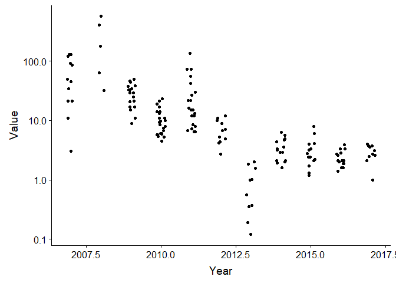

## Setup

### Libraries

```r
library(dplyr)
```

```
## 
## Attaching package: 'dplyr'
```

```
## The following objects are masked from 'package:stats':
## 
##     filter, lag
```

```
## The following objects are masked from 'package:base':
## 
##     intersect, setdiff, setequal, union
```

```r
library(niRvana)
library(ggplot2)
library(tidyr)

# install.packages("ODBC")
source("05_Add_MILKYS_data_functions.R")
```

### Set username and password

```r
# set_credentials()
```

## Data  
### Read data  
- dat: Excel data from Merete
- dat2_means: based on Excel data, species and tissua added, no less-thans (not used here)
- cemp_comb: Access data 
- data_ind2: Access data, updated with NIVAbasen data through 2017

```r
# Data from Merete (stacked data)
dat <- readxl::read_excel("Input_data/001 PFAS stacked data table.xlsx", guess_max = 11000)
```

```
## Warning in read_fun(path = path, sheet_i = sheet, limits = limits, shim =
## shim, : Expecting numeric in S58608 / R58608C19: got 'Sum'
```

```
## Warning in read_fun(path = path, sheet_i = sheet, limits = limits, shim =
## shim, : Expecting numeric in S58609 / R58609C19: got 'Sum'
```

```
## Warning in read_fun(path = path, sheet_i = sheet, limits = limits, shim =
## shim, : Expecting numeric in S58622 / R58622C19: got 'Sum'
```

```
## Warning in read_fun(path = path, sheet_i = sheet, limits = limits, shim =
## shim, : Expecting numeric in S58640 / R58640C19: got 'PF37DMOA'
```

```
## Warning in read_fun(path = path, sheet_i = sheet, limits = limits, shim =
## shim, : Expecting numeric in S58643 / R58643C19: got 'FTS, H4PFOS'
```

```
## Warning in read_fun(path = path, sheet_i = sheet, limits = limits, shim =
## shim, : Expecting numeric in S58644 / R58644C19: got 'Sum'
```

```
## Warning in read_fun(path = path, sheet_i = sheet, limits = limits, shim =
## shim, : Expecting numeric in S58646 / R58646C19: got 'Sum'
```

```
## Warning in read_fun(path = path, sheet_i = sheet, limits = limits, shim =
## shim, : Expecting numeric in S58655 / R58655C19: got 'PF37DMOA'
```

```
## Warning in read_fun(path = path, sheet_i = sheet, limits = limits, shim =
## shim, : Expecting numeric in S58659 / R58659C19: got 'FTS, H4PFOS'
```

```
## Warning in read_fun(path = path, sheet_i = sheet, limits = limits, shim =
## shim, : Expecting numeric in S58660 / R58660C19: got 'Sum'
```

```
## Warning in read_fun(path = path, sheet_i = sheet, limits = limits, shim =
## shim, : Expecting numeric in S58668 / R58668C19: got 'Sum'
```

```
## Warning in read_fun(path = path, sheet_i = sheet, limits = limits, shim =
## shim, : Expecting numeric in S58669 / R58669C19: got 'Sum'
```

```
## Warning in read_fun(path = path, sheet_i = sheet, limits = limits, shim =
## shim, : Expecting numeric in S58683 / R58683C19: got 'Sum'
```

```
## Warning in read_fun(path = path, sheet_i = sheet, limits = limits, shim =
## shim, : Expecting numeric in S58689 / R58689C19: got 'PF37DMOA'
```

```
## Warning in read_fun(path = path, sheet_i = sheet, limits = limits, shim =
## shim, : Expecting numeric in S58695 / R58695C19: got 'Sum'
```

```
## Warning in read_fun(path = path, sheet_i = sheet, limits = limits, shim =
## shim, : Expecting numeric in S58696 / R58696C19: got 'FTS, H4PFOS'
```

```
## Warning in read_fun(path = path, sheet_i = sheet, limits = limits, shim =
## shim, : Expecting numeric in S58700 / R58700C19: got 'Sum'
```

```
## Warning in read_fun(path = path, sheet_i = sheet, limits = limits, shim =
## shim, : Expecting numeric in S58701 / R58701C19: got 'Sum'
```

```
## Warning in read_fun(path = path, sheet_i = sheet, limits = limits, shim =
## shim, : Expecting numeric in S58774 / R58774C19: got 'PF37DMOA'
```

```
## Warning in read_fun(path = path, sheet_i = sheet, limits = limits, shim =
## shim, : Expecting numeric in S58785 / R58785C19: got 'FTS, H4PFOS'
```

```
## Warning in read_fun(path = path, sheet_i = sheet, limits = limits, shim =
## shim, : Expecting numeric in S58791 / R58791C19: got 'FTS, H4PFOS'
```

```
## Warning in read_fun(path = path, sheet_i = sheet, limits = limits, shim =
## shim, : Expecting numeric in S58800 / R58800C19: got 'PF37DMOA'
```

```
## Warning in read_fun(path = path, sheet_i = sheet, limits = limits, shim =
## shim, : Expecting numeric in S58810 / R58810C19: got 'PF37DMOA'
```

```
## Warning in read_fun(path = path, sheet_i = sheet, limits = limits, shim =
## shim, : Expecting numeric in S58826 / R58826C19: got 'FTS, H4PFOS'
```

```
## Warning in read_fun(path = path, sheet_i = sheet, limits = limits, shim =
## shim, : Expecting numeric in S58828 / R58828C19: got 'Sum'
```

```
## Warning in read_fun(path = path, sheet_i = sheet, limits = limits, shim =
## shim, : Expecting numeric in S58829 / R58829C19: got 'Sum'
```

```
## Warning in read_fun(path = path, sheet_i = sheet, limits = limits, shim =
## shim, : Expecting numeric in S58830 / R58830C19: got 'Sum'
```

```
## Warning in read_fun(path = path, sheet_i = sheet, limits = limits, shim =
## shim, : Expecting numeric in S58831 / R58831C19: got 'Sum'
```

```
## Warning in read_fun(path = path, sheet_i = sheet, limits = limits, shim =
## shim, : Expecting numeric in S58832 / R58832C19: got 'Sum'
```

```
## Warning in read_fun(path = path, sheet_i = sheet, limits = limits, shim =
## shim, : Expecting numeric in S58833 / R58833C19: got 'Sum'
```

```
## Warning in read_fun(path = path, sheet_i = sheet, limits = limits, shim =
## shim, : Expecting numeric in S58836 / R58836C19: got 'FTS, H4PFOS'
```

```
## Warning in read_fun(path = path, sheet_i = sheet, limits = limits, shim =
## shim, : Expecting numeric in S58840 / R58840C19: got 'PF37DMOA'
```

```
## Warning in read_fun(path = path, sheet_i = sheet, limits = limits, shim =
## shim, : Expecting numeric in S58858 / R58858C19: got 'FTS, H4PFOS'
```

```
## Warning in read_fun(path = path, sheet_i = sheet, limits = limits, shim =
## shim, : Expecting numeric in S58861 / R58861C19: got 'PF37DMOA'
```

```
## Warning in read_fun(path = path, sheet_i = sheet, limits = limits, shim =
## shim, : Expecting numeric in S58880 / R58880C19: got 'PF37DMOA'
```

```
## Warning in read_fun(path = path, sheet_i = sheet, limits = limits, shim =
## shim, : Expecting numeric in S58884 / R58884C19: got 'FTS, H4PFOS'
```

```r
# From script 05 - 'dat2_means' (duplicate-free version of 'dat2')
dat2 <- readRDS(file = "Data/04_dat2.rds")
dat2_means <- readRDS(file = "Data/04_dat2_means.rds")

# Access data
load("Input_data/Milkys_Data_2017_02_14_cemp_combinedtable.RData")  # cemp_comb
# load("Input_data/Milkys_Data_2017_02_14_cemp_tables.RData")  # cemp_c2, cemp_f2, cemp_t 

# Access data with NIVAbasen data added for 2015-2017
fn <- "../Milkys_2018/Data/12_data_ind2_2018-08-23.RData"
data_ind2 <- readRDS(fn)
```


### cemp_comb + data_ind2: Add 'param2'

```r
cemp_comb <- cemp_comb %>%
  left_join(cemp_synonyms) %>%
  mutate(param2 = ifelse(is.na(param_standard), param, param_standard)) %>%
  select(-param_standard)
```

```
## Joining, by = "param"
```

```r
cemp_comb %>%
  filter(param != param2) %>%
  count(param, param2)
```

```
## # A tibble: 10 x 3
##    param  param2     n
##    <chr>  <chr>  <int>
##  1 PFDcA  PFDA     105
##  2 PFDCA  PFDA     197
##  3 PFDcS  PFDS     105
##  4 PFDCS  PFDS     191
##  5 PFDOA  PFDoDA     6
##  6 PFDODA PFDoDA    25
##  7 PFHPA  PFHpA   1288
##  8 PFHXA  PFHxA   1287
##  9 PFHXS  PFHxS    222
## 10 PFUdA  PFUnDA   321
```

```r
data_ind2 <- data_ind2 %>%
  left_join(cemp_synonyms, by = c("PARAM" = "param")) %>%
  mutate(param2 = ifelse(is.na(param_standard), PARAM, param_standard)) %>%
  select(-param_standard)
```


### Same station/year in 4 datasets  

```r
# Access database
test_cemp <- cemp_comb %>%
  filter(jmpst %in% "36B" & myear %in% 2013 & param %in% "PFOS") 
# View(test_cemp)
test_cemp
```

```
##    myear seqno rlabo subno tissu param repno inorb vflag qflag unit basis
## 1   2013   361  NIVA     2    LI  PFOS     1     I     A  <NA>    U     W
## 2   2013   361  NIVA     4    LI  PFOS     1     I     A  <NA>    U     W
## 3   2013   361  NIVA     5    LI  PFOS     1     I     A  <NA>    U     W
## 4   2013   361  NIVA     8    LI  PFOS     1     I     A  <NA>    U     W
## 5   2013   361  NIVA     9    LI  PFOS     1     I     A  <NA>    U     W
## 6   2013   361  NIVA    11    LI  PFOS     1     I     A  <NA>    U     W
## 7   2013   361  NIVA    14    LI  PFOS     1     I     A  <NA>    U     W
## 8   2013   361  NIVA    30    LI  PFOS     1     B     A  <NA>    U     W
## 9   2013   361  NIVA    31    LI  PFOS     1     B     A  <NA>    U     W
## 10  2013   361  NIVA    32    LI  PFOS     1     B     A  <NA>    U     W
##    basis_n_distinct valsnf tiswt drywt exlip exlim tiswtx drywtx fatwtx
## 1                 1   0.12 26.12    58  46.9     D     NA  26.12   <NA>
## 2                 1   1.02 23.01    50  36.8     D     NA  23.01   <NA>
## 3                 1   0.37 22.26    54  43.5     D     NA  22.26   <NA>
## 4                 1   0.99 28.38    55  43.7     D     NA  28.38   <NA>
## 5                 1   0.35 33.50    61  50.4     D     NA  33.50   <NA>
## 6                 1   0.19 29.90    55  43.9     D     NA  29.90   <NA>
## 7                 1   0.56 28.70    59  42.0     D     NA  28.70   <NA>
## 8                 1   1.58 12.22    47  36.7     D  85.55     NA   <NA>
## 9                 1   1.83 16.75    47  33.0     D 117.30     NA   <NA>
## 10                1   1.99 15.11    47  34.1     D 105.80     NA   <NA>
##    gmlim Liver_yellow Liver_brown Liver_red Liver_white Liver_grey
## 1   <NA>            1           0         0           1          0
## 2   <NA>            0           0         1           0          0
## 3   <NA>            0           0         1           1          0
## 4   <NA>            0           0         1           1          0
## 5   <NA>            0           0         1           1          0
## 6   <NA>            0           0         1           1          0
## 7   <NA>            0           0         1           1          0
## 8   <NA>            0           0         0           0          0
## 9   <NA>            0           0         0           0          0
## 10  <NA>            0           0         0           0          0
##    Liver_green Liver_pink  Liver_color lnmin lnmax  lnmea lnstd wtmin
## 1            0          0 yellow-white    NA    NA 410.00    NA    NA
## 2            0          0          red    NA    NA 435.00    NA    NA
## 3            0          0    red-white    NA    NA 415.00    NA    NA
## 4            0          0    red-white    NA    NA 430.00    NA    NA
## 5            0          0    red-white    NA    NA 435.00    NA    NA
## 6            0          0    red-white    NA    NA 440.00    NA    NA
## 7            0          0    red-white    NA    NA 430.00    NA    NA
## 8            0          0                405   460 434.28 19.02   658
## 9            0          0                415   440 424.28  7.86   703
## 10           0          0                380   455 421.42 25.28   553
##    wtmax  wtmea  wtstd sexco agmin agmax agmea gonwt shlwt agdet shlwtx
## 1     NA 739.00     NA     M    NA    NA  2.00    NA    NA     O     NA
## 2     NA 814.00     NA     F    NA    NA  2.00    NA    NA     O     NA
## 3     NA 723.00     NA     M    NA    NA  2.00    NA    NA     O     NA
## 4     NA 822.00     NA     F    NA    NA  2.00    NA    NA     O     NA
## 5     NA 877.00     NA     F    NA    NA  2.00    NA    NA     O     NA
## 6     NA 934.00     NA     M    NA    NA  3.00    NA    NA     O     NA
## 7     NA 887.00     NA     F    NA    NA  2.00    NA    NA     O     NA
## 8    909 798.42  84.72     X     2     4  2.42    NA    NA     O     NA
## 9    905 800.71  73.98     X    NA    NA    NA    NA    NA  <NA>     NA
## 10  1013 762.28 142.04     X    NA    NA    NA    NA    NA  <NA>     NA
##    imposex_sh imposex_pe imposex_stage jmpst    speci    sdate lnmea2
## 1          NA         NA            NA   36B GADU MOR 20130901 410.00
## 2          NA         NA            NA   36B GADU MOR 20130901 435.00
## 3          NA         NA            NA   36B GADU MOR 20130901 415.00
## 4          NA         NA            NA   36B GADU MOR 20130901 430.00
## 5          NA         NA            NA   36B GADU MOR 20130901 435.00
## 6          NA         NA            NA   36B GADU MOR 20130901 440.00
## 7          NA         NA            NA   36B GADU MOR 20130901 430.00
## 8          NA         NA            NA   36B GADU MOR 20130901 434.28
## 9          NA         NA            NA   36B GADU MOR 20130901 424.28
## 10         NA         NA            NA   36B GADU MOR 20130901 421.42
##    Cryptocotyle_lingua Anisakis Ulceration Caligiform param2
## 1                FALSE    FALSE      FALSE      FALSE   PFOS
## 2                FALSE    FALSE      FALSE      FALSE   PFOS
## 3                FALSE    FALSE      FALSE      FALSE   PFOS
## 4                FALSE    FALSE      FALSE      FALSE   PFOS
## 5                FALSE    FALSE      FALSE      FALSE   PFOS
## 6                FALSE    FALSE      FALSE      FALSE   PFOS
## 7                FALSE    FALSE      FALSE      FALSE   PFOS
## 8                FALSE    FALSE      FALSE      FALSE   PFOS
## 9                FALSE    FALSE      FALSE      FALSE   PFOS
## 10               FALSE    FALSE      FALSE      FALSE   PFOS
```

```r
# Access + NIVAbasen database
test_cemp2 <- data_ind2 %>%
  filter(STATION_CODE %in% "36B" & MYEAR %in% 2013 & param2 %in% "PFOS") 
# View(test_cemp2)
test_cemp2
```

```
##    MYEAR STATION_CODE   LATIN_NAME TISSUE_NAME SAMPLE_NO2 BASIS UNIT PARAM
## 1   2013          36B Gadus morhua       Lever          2     W    U  PFOS
## 2   2013          36B Gadus morhua       Lever          4     W    U  PFOS
## 3   2013          36B Gadus morhua       Lever          5     W    U  PFOS
## 4   2013          36B Gadus morhua       Lever          8     W    U  PFOS
## 5   2013          36B Gadus morhua       Lever          9     W    U  PFOS
## 6   2013          36B Gadus morhua       Lever         11     W    U  PFOS
## 7   2013          36B Gadus morhua       Lever         14     W    U  PFOS
## 8   2013          36B Gadus morhua       Lever         19     W    U  PFOS
## 9   2013          36B Gadus morhua       Lever         20     W    U  PFOS
## 10  2013          36B Gadus morhua       Lever         21     W    U  PFOS
##    DRYWT FAT_PERC  LNMEA FLAG1 VALUE_WW  VALUE_DW  VALUE_FB   VALUE_WWa
## 1     58     46.9 410.00  <NA>     0.12 0.2068966 0.2558635 -0.11513693
## 2     50     36.8 435.00  <NA>     1.02 2.0400000 2.7717391  0.70387502
## 3     54     43.5 415.00  <NA>     0.37 0.6851852 0.8505747  0.09664049
## 4     55     43.7 430.00  <NA>     0.99 1.8000000 2.2654462  0.65673779
## 5     61     50.4 435.00  <NA>     0.35 0.5737705 0.6944444  0.13872836
## 6     55     43.9 440.00  <NA>     0.19 0.3454545 0.4328018  0.01699541
## 7     59     42.0 430.00  <NA>     0.56 0.9491525 1.3333333  0.29874922
## 8     47     36.7 434.28  <NA>     1.58 3.3617021 4.3051771  1.17213762
## 9     47     33.0 424.28  <NA>     1.83 3.8936170 5.5454545  1.32104061
## 10    47     34.1 421.42  <NA>     1.99 4.2340426 5.8357771  1.43397039
##      VALUE_DWa   VALUE_FBa param2
## 1  -0.07833889 -0.06035376   PFOS
## 2   1.50208604  2.05884509   PFOS
## 3   0.30633432  0.40710767   PFOS
## 4   1.27028928  1.60591106   PFOS
## 5   0.29529907  0.37417856   PFOS
## 6   0.12409541  0.18086634   PFOS
## 7   0.58040719  0.86206072   PFOS
## 8   2.58218383  3.29247622   PFOS
## 9   2.90041545  4.12802647   PFOS
## 10  3.13615685  4.30633957   PFOS
```

```r
#
# Commented out in order to 
#
# Database (WILAB)
# test_wilab <- get_nivabase_data("select * from WILAB.TEST where TESTNO like '2013-02901'")
# test_wilab %>% select(TESTNO, SERIALNO, MARKING, DESCRIPT, X5, X9)

# Excel data
sel <- with(dat, substr(LIMS,4,7) == "2013" & Species %in% "Gadus morhua" & Description %in% "36B" & PFAS %in% "PFOS")
sum(sel)
```

```
## [1] 10
```

```r
# View(dat[sel, ])
dat[sel,] %>% select(Description, Project, LIMS, Matrix_orig, Matrix, Species, Organ_orig, Organ, Label_original, PFAS, Data)
```

```
## # A tibble: 10 x 11
##    Description Project LIMS  Matrix_orig Matrix Species Organ_orig Organ
##    <chr>       <chr>   <chr> <chr>       <chr>  <chr>   <chr>      <chr>
##  1 36B         MilKys  NR-2~ Biota       biota  Gadus ~ <NA>       <NA> 
##  2 36B         MilKys  NR-2~ Biota       biota  Gadus ~ <NA>       <NA> 
##  3 36B         MilKys  NR-2~ Biota       biota  Gadus ~ <NA>       <NA> 
##  4 36B         MilKys  NR-2~ Biota       biota  Gadus ~ <NA>       <NA> 
##  5 36B         MilKys  NR-2~ Biota       biota  Gadus ~ <NA>       <NA> 
##  6 36B         MilKys  NR-2~ Biota       biota  Gadus ~ <NA>       <NA> 
##  7 36B         MilKys  NR-2~ Biota       biota  Gadus ~ <NA>       <NA> 
##  8 36B         MilKys  NR-2~ Biota       biota  Gadus ~ <NA>       <NA> 
##  9 36B         MilKys  NR-2~ Biota       biota  Gadus ~ <NA>       <NA> 
## 10 36B         MilKys  NR-2~ Biota       biota  Gadus ~ <NA>       <NA> 
## # ... with 3 more variables: Label_original <chr>, PFAS <chr>, Data <chr>
```


### Number of PFAS params  
For the example station/year

```r
cat("Excel data:\n")
```

```
## Excel data:
```

```r
dat %>%
  filter(substr(LIMS,4,7) == "2013" & Species %in% "Gadus morhua" & Description %in% "36B") %>%
  pull(PFAS) %>%
  unique() %>% sort()
```

```
##  [1] "PFBS"   "PFDA"   "PFDS"   "PFHpA"  "PFHxA"  "PFHxS"  "PFNA"  
##  [8] "PFOA"   "PFOS"   "PFOSA"  "PFUnDA"
```

```r
# Access
df <- cemp_comb %>%
  filter(jmpst %in% "36B" & myear %in% 2013 & substr(param,1,2) == "PF")
cat("\nAccess, new names:\n")
```

```
## 
## Access, new names:
```

```r
df %>%
  pull(param2) %>%
  unique() %>% sort()
```

```
##  [1] "PFBS"   "PFDA"   "PFDS"   "PFHpA"  "PFHxA"  "PFHxS"  "PFNA"  
##  [8] "PFOA"   "PFOS"   "PFOSA"  "PFUnDA"
```

```r
cat("\nAccess, old names:\n")
```

```
## 
## Access, old names:
```

```r
df %>%
  pull(param) %>%
  unique() %>% sort()
```

```
##  [1] "PFBS"  "PFDCA" "PFDCS" "PFHPA" "PFHXA" "PFHXS" "PFNA"  "PFOA" 
##  [9] "PFOS"  "PFOSA" "PFUdA"
```

```r
# Access + NIVAbasen
df <- data_ind2 %>%
  filter(STATION_CODE %in% "36B" & MYEAR %in% 2013 & substr(param2,1,2) %in% "PF") 
cat("\nAccess + NIVAbasen, new names:\n")
```

```
## 
## Access + NIVAbasen, new names:
```

```r
df %>%
  pull(param2) %>%
  unique() %>% sort()
```

```
##  [1] "PFAS"   "PFBS"   "PFDA"   "PFDS"   "PFHpA"  "PFHxA"  "PFHxS" 
##  [8] "PFNA"   "PFOA"   "PFOS"   "PFOSA"  "PFUnDA"
```

```r
cat("\nAccess + NIVAbasen, old names:\n")
```

```
## 
## Access + NIVAbasen, old names:
```

```r
df %>%
  pull(PARAM) %>%
  unique() %>% sort()
```

```
##  [1] "PFAS"  "PFBS"  "PFDcA" "PFDCS" "PFHpA" "PFHxA" "PFHxS" "PFNA" 
##  [9] "PFOA"  "PFOS"  "PFOSA" "PFUdA"
```


### Number of PFAS params 2
For a different station/year (Sørfjorden)

```r
cat("Excel data:\n")
```

```
## Excel data:
```

```r
dat %>%
  filter(substr(LIMS,4,7) == "2009" & Species %in% "Gadus morhua" & Description %in% "23B") %>%
  pull(PFAS) %>%
  unique() %>% sort()
```

```
## [1] "PFBS"  "PFHpA" "PFHxA" "PFNA"  "PFOA"  "PFOS"  "PFOSA"
```

```r
# Access
df <- cemp_comb %>%
  filter(jmpst %in% "23B" & myear %in% 2009 & substr(param,1,2) == "PF")
cat("\nAccess, new names:\n")
```

```
## 
## Access, new names:
```

```r
df %>%
  pull(param2) %>%
  unique() %>% sort()
```

```
## [1] "PFBS"  "PFHpA" "PFHxA" "PFNA"  "PFOA"  "PFOS"  "PFOSA"
```

```r
cat("\nAccess, old names:\n")
```

```
## 
## Access, old names:
```

```r
df %>%
  pull(param) %>%
  unique() %>% sort()
```

```
## [1] "PFBS"  "PFHPA" "PFHXA" "PFNA"  "PFOA"  "PFOS"  "PFOSA"
```

### Recreate cemp_synonyms and use it   
Used only while refining cemp_synonyms (in the ...functions file)

```r
# source("05_Add_MILKYS_data_functions.R")
# load("Input_data/Milkys_Data_2017_02_14_cemp_combinedtable.RData")  # cemp_comb
# cemp_comb <- cemp_comb %>%
#   left_join(cemp_synonyms) %>%
#   mutate(param2 = ifelse(is.na(param_standard), param, param_standard)) %>%
#   select(-param_standard)
```
## 11 most common parameters in cod
### Excel data

```r
# cat("Excel data:\n")
df <- dat %>%
  filter(Year <= 2014 & Species %in% "Gadus morhua") %>%
  count(PFAS) %>%
  filter(n > 10) %>%
  arrange(PFAS)
df %>% pull(PFAS)
```

```
##  [1] "PFBS"   "PFDA"   "PFDS"   "PFHpA"  "PFHxA"  "PFHxS"  "PFNA"  
##  [8] "PFOA"   "PFOS"   "PFOSA"  "PFUnDA"
```

```r
# "PFBS"   "PFDA"   "PFDS"   "PFHpA"  "PFHxA"  "PFHxS"  "PFNA"   "PFOA"   "PFOS"   "PFOSA"  "PFUnDA" - the 11 most common ones
# And the same as in CEMP
df
```

```
## # A tibble: 11 x 2
##    PFAS       n
##    <chr>  <int>
##  1 PFBS     823
##  2 PFDA     362
##  3 PFDS     363
##  4 PFHpA    823
##  5 PFHxA    823
##  6 PFHxS    363
##  7 PFNA     823
##  8 PFOA     797
##  9 PFOS     823
## 10 PFOSA    809
## 11 PFUnDA   362
```

### Access

```r
df <- cemp_comb %>%
  filter(myear <= 2014 & grepl("^PF", param2) & speci == "GADU MOR") %>%
  count(param2) %>%
  filter(n > 50) %>%
  arrange(param2)
df %>% pull(param2)
```

```
##  [1] "PFBS"   "PFDA"   "PFDS"   "PFHpA"  "PFHxA"  "PFHxS"  "PFNA"  
##  [8] "PFOA"   "PFOS"   "PFOSA"  "PFUnDA"
```

```r
df
```

```
## # A tibble: 11 x 2
##    param2     n
##    <chr>  <int>
##  1 PFBS    1386
##  2 PFDA     320
##  3 PFDS     320
##  4 PFHpA   1386
##  5 PFHxA   1385
##  6 PFHxS    320
##  7 PFNA    1386
##  8 PFOA    1386
##  9 PFOS    1386
## 10 PFOSA   1249
## 11 PFUnDA   320
```

```r
# "PFBS"   "PFDA"   "PFDS"   "PFHpA"  "PFHxA"  "PFHxS"  "PFNA"   "PFOA"   "PFOS"   "PFOSA"  "PFUnDA" - the 11 most common ones
```


## The less used parameters in cod
### Excel data

```r
# cat("Excel data:\n")
df <- dat %>%
  filter(Year <= 2014 & Species %in% "Gadus morhua") %>%
  count(PFAS) %>%
  filter(n < 10) %>%
  arrange(PFAS)
df %>% pull(PFAS)
```

```
##  [1] "10:2 FTOH" "12:2 FTOH" "4:2 FTOH"  "6:2 FTOH"  "6:2 FTS"  
##  [6] "8:2 FTOH"  "8:2 FTS"   "N-EtFOSA"  "N-EtFOSE"  "N-MeFOSA" 
## [11] "N-MeFOSE"  "PFBA"      "PFDoDA"    "PFDoS"     "PFHpS"    
## [16] "PFNS"      "PFPA"      "PFPeS"     "PFPS"      "PFTeDA"   
## [21] "PFTeS"     "PFTrDA"    "PFTrS"     "PFUnS"
```

```r
# "10:2 FTOH" "12:2 FTOH" "4:2 FTOH"  "6:2 FTOH"  "6:2 FTS"   "8:2 FTOH"  "8:2 FTS"   "N-EtFOSA"  "N-EtFOSE"  "N-MeFOSA" 
# "N-MeFOSE"  "PFBA"      "PFDoDA"    "PFDoS"     "PFHpS"     "PFNS"      "PFPA"      "PFPeS"     "PFPS"      "PFTeDA"   
# "PFTeS"     "PFTrDA"    "PFTrS"     "PFUnS"
df
```

```
## # A tibble: 24 x 2
##    PFAS          n
##    <chr>     <int>
##  1 10:2 FTOH     3
##  2 12:2 FTOH     3
##  3 4:2 FTOH      3
##  4 6:2 FTOH      3
##  5 6:2 FTS       3
##  6 8:2 FTOH      3
##  7 8:2 FTS       3
##  8 N-EtFOSA      3
##  9 N-EtFOSE      3
## 10 N-MeFOSA      3
## # ... with 14 more rows
```


### Access

```r
df <- cemp_comb %>%
  filter(myear <= 2014 & grepl("^PF", param2) & speci == "GADU MOR") %>%
  count(param2) %>%
  filter(n <= 50) %>%
  arrange(param2)
df %>% pull(param2)
```

```
## [1] "PFBA"   "PFDoDA" "PFHXDA" "PFODA"  "PFPeA"  "PFTeDA" "PFTrDA"
```

```r
# Here:            "PFBA"   "PFDoDA" "PFHXDA" "PFODA"  "PFPeA"  "PFTeDA" "PFTrDA"
# In Excel data:     x         x                                   x        x
df
```

```
## # A tibble: 7 x 2
##   param2     n
##   <chr>  <int>
## 1 PFBA      25
## 2 PFDoDA    25
## 3 PFHXDA    25
## 4 PFODA     25
## 5 PFPeA     25
## 6 PFTeDA    25
## 7 PFTrDA    25
```

## Number of observations, cod (PFOS obs per year)
### Excel data

```r
# cat("Excel data:\n")
dat %>%
  filter(Year <= 2014 & Species %in% "Gadus morhua" & PFAS == "PFOS" & Description == "23B") %>%
  count(Year)
```

```
## # A tibble: 10 x 2
##     Year     n
##    <dbl> <int>
##  1  1993     1
##  2  2005     1
##  3  2006     2
##  4  2007     1
##  5  2009    21
##  6  2010    20
##  7  2011     8
##  8  2012    11
##  9  2013    16
## 10  2014    14
```

### Access  
The number of observations in Access is much higher and makes much more sense

```r
cemp_comb %>%
  filter(myear <= 2014 & speci == "GADU MOR" & param2 %in% "PFOS" & jmpst %in% "23B") %>%
  count(myear)
```

```
## # A tibble: 11 x 2
##    myear     n
##    <int> <int>
##  1  1993     8
##  2  2005    18
##  3  2006    20
##  4  2007    23
##  5  2008    25
##  6  2009    25
##  7  2010    25
##  8  2011    25
##  9  2012    11
## 10  2013    15
## 11  2014    14
```

## Stations, cod (PFOS as example)
### Excel data

```r
# cat("Excel data:\n")
dat %>%
  filter(Year <= 2014 & Species %in% "Gadus morhua" & PFAS == "PFOS") %>%
  count(Description)
```

```
## # A tibble: 15 x 2
##    Description     n
##    <chr>       <int>
##  1 10B             3
##  2 13B            34
##  3 13BH           65
##  4 15B            25
##  5 23B            95
##  6 30B           112
##  7 36A             1
##  8 36B           104
##  9 43B            21
## 10 43B2           80
## 11 53B            76
## 12 67B             1
## 13 80B            77
## 14 92B            49
## 15 98B1           80
```

### Access  
The same stations, but lacking '13BH' and with 145B, 146B and 147B in addition

```r
cemp_comb %>%
  filter(myear <= 2014 & speci == "GADU MOR" & param2 %in% "PFOS") %>%
  count(jmpst)
```

```
## # A tibble: 16 x 2
##    jmpst     n
##    <chr> <int>
##  1 10B      19
##  2 13B     106
##  3 145B     11
##  4 146B     25
##  5 147B     25
##  6 15B      45
##  7 23B     209
##  8 30B     212
##  9 36B     127
## 10 43B      41
## 11 43B2    120
## 12 53B     176
## 13 67B      15
## 14 80B      81
## 15 92B      50
## 16 98B1    124
```

## Number of observations, blue mussel (PFOS obs per year)
### Excel data  
Extremely few observations up until 2014 (and not so many thereafter)  

```r
# dat %>%
#   count(Species)
dat %>%
  filter(Year <= 2014 & Species %in% "Blåskjell" & PFAS == "PFOS") %>%
  count(Description, Year)
```

```
## # A tibble: 9 x 3
##   Description  Year     n
##   <chr>       <dbl> <int>
## 1 <NA>         2013     3
## 2 <NA>         2014     3
## 3 22A          2007     1
## 4 23B          2011     1
## 5 30A          2007     1
## 6 30B          2011     7
## 7 36A          2006     1
## 8 71A          2006     3
## 9 I301         2007     1
```

### Access  
Even fewer observations  

```r
cemp_comb %>%
  filter(speci == "MYTI EDU" & param2 %in% "PFOS") %>%
  count(speci, jmpst, myear)
```

```
## # A tibble: 6 x 4
##   speci    jmpst myear     n
##   <chr>    <chr> <int> <int>
## 1 MYTI EDU 35A    2015     1
## 2 MYTI EDU B11    2015     1
## 3 MYTI EDU B2     2015     1
## 4 MYTI EDU B3     2015     1
## 5 MYTI EDU B4     2015     1
## 6 MYTI EDU B5     2015     1
```

```r
# cat("Excel data:\n")
```
## Make ready for making new version of data set  
- Delete MilKys cod through 2017, and replace those data with cod data from Access   
- Only 
- Also add new columns for fat, dry weight,length, weight   

### Counts

```r
data_ind2 %>% filter(LATIN_NAME %in% "Gadus morhua" & param2 %in% "PFOS") %>% nrow()
```

```
## [1] 1705
```

```r
dat2_means %>% filter(Species %in% "Gadus morhua" & PFAS %in% "PFOS") %>% nrow()
```

```
## [1] 1230
```

### Tissues
Lever only  

```r
dat2 %>% 
  filter(Project %in% "MilKys") %>%
  count(Project, Species, Organ)
```

```
## # A tibble: 12 x 4
##    Project Species                    Organ          n
##    <chr>   <chr>                      <chr>      <int>
##  1 MilKys  Blåskjell                  <NA>         212
##  2 MilKys  Blåskjell                  whole body   408
##  3 MilKys  Gadus morhua               <NA>        7249
##  4 MilKys  Gadus morhua               liver       4553
##  5 MilKys  Lepidorhombus whiffiagonis <NA>         210
##  6 MilKys  Limanda limanda            <NA>          91
##  7 MilKys  Littorina littorea         <NA>           7
##  8 MilKys  Nucella lapillus           <NA>          14
##  9 MilKys  Platichthys flesus         <NA>         140
## 10 MilKys  Pleuronectes platessa      <NA>         133
## 11 MilKys  Somateria mollissima       blood        150
## 12 MilKys  Somateria mollissima       egg          150
```

```r
data_ind2 %>% 
  filter(LATIN_NAME %in% c("Gadus morhua", "Platichthys flesus", "Limanda limanda")) %>%
  filter(grepl("^PF", PARAM)) %>%
  count(LATIN_NAME, TISSUE_NAME) # %>% pull(TISSUE_NAME)
```

```
## # A tibble: 1 x 3
##   LATIN_NAME   TISSUE_NAME     n
##   <chr>        <chr>       <int>
## 1 Gadus morhua Lever       16084
```

### Units 1
Access data = U, NIVAbasen = UG_P_KG, Excel = ng/g  
We test below that they are the same  

```r
data_ind2 %>%
  filter(LATIN_NAME %in% "Gadus morhua" & param2 %in% "PFOS") %>%
  xtabs(~MYEAR + UNIT, .)
```

```
##       UNIT
## MYEAR    U UG_P_KG
##   1993  16       0
##   2005  57       0
##   2006  80       0
##   2007 115       0
##   2008 107       0
##   2009 280       0
##   2010 162       0
##   2011 202       0
##   2012  87       0
##   2013 102       0
##   2014 105       0
##   2015   0     128
##   2016   0     131
##   2017   0     133
```

```r
dat %>%
  filter(Species %in% "Gadus morhua" & PFAS %in% "PFOS") %>%
  count(Unit)
```

```
## # A tibble: 1 x 2
##   Unit      n
##   <chr> <int>
## 1 ng/g   1275
```
### Units 2 - test using plot (2013)  
Unit UG_P_KG in Access + NIVAbase, vs ng/g for Excel  

```r
# Access + NIVAbasen database
library(cowplot)
```

```
## 
## Attaching package: 'cowplot'
```

```
## The following object is masked from 'package:ggplot2':
## 
##     ggsave
```

```r
test1 <- dat %>%
  filter(Year == "2013" & Species %in% "Gadus morhua" & Description %in% "36B" & PFAS %in% "PFOS") %>%
  mutate(Value = as.numeric(sub("<","", Data)),
         Flag = ifelse(grepl("<", Data), "<", as.character(NA)))
gg1 <- ggplot(test1, aes(x = Flag, y = Value)) + 
  geom_point() +
  labs(title = "Access + NIVAbase (2013)")

# par(mfrow = c(1,2), mar = c(4,5,2,1))
# plot(test1$Value)

# Excel data

test2 <- data_ind2 %>%
  filter(STATION_CODE %in% "36B" & MYEAR %in% 2013 & param2 %in% "PFOS") 
gg2 <- ggplot(test2, aes(x = FLAG1, y = VALUE_WW)) + 
  geom_point() + 
  labs(title = "Excel (2013)")

plot_grid(gg1, gg2, ncol = 2)
```

<!-- -->

### Units 3 - test using plot (2009)
Unit U in Access + NIVAbase, vs ng/g for Excel  

```r
# Access + NIVAbasen database
library(cowplot)

test1 <- dat %>%
  filter(Year == "2009" & Species %in% "Gadus morhua" & Description %in% "36B" & PFAS %in% "PFOS") %>%
  mutate(Value = as.numeric(sub("<","", Data)),
         Flag = ifelse(grepl("<", Data), "<", as.character(NA)))
gg1 <- ggplot(test1, aes(x = Flag, y = Value)) + 
  geom_point() +
  labs(title = "Access + NIVAbase (2009)")

# par(mfrow = c(1,2), mar = c(4,5,2,1))
# plot(test1$Value)

# Excel data

test2 <- data_ind2 %>%
  filter(STATION_CODE %in% "36B" & MYEAR %in% 2009 & param2 %in% "PFOS") 
gg2 <- ggplot(test2, aes(x = FLAG1, y = VALUE_WW)) + 
  geom_point() + 
  labs(title = "Excel (2009)")

plot_grid(gg1, gg2, ncol = 2)
```

<!-- -->
## Make new version of data set (dat2)


```r
sel <- is.na(dat$Data)
mean(sel)  # 0.00087
```

```
## [1] 0.000872864
```

### Make data set 'dat_withoutcod' by deleting the cod data  
And also adding Value amd Flag as well as dryweight, fat percent and 

```r
# 
dat_withoutcod <- dat %>%
  filter(!(Species %in% "Gadus morhua" & Project %in% "MilKys")) %>%  # Remove MilKys fish
  mutate(Value = as.numeric(sub("<","", Data)),                     # Make Value from Data
         Flag = ifelse(grepl("<", Data), "<", as.character(NA)),    # Make Flag (less-than sign)
         Drywt = as.numeric(NA),
         Fatperc = as.numeric(NA),
         Length = as.numeric(NA))

nrow(dat)
```

```
## [1] 59574
```

```r
nrow(dat_withoutcod)
```

```
## [1] 47772
```

### Make data for adding ('data_to_add')
Note that we "construct" new values for "LIMS" on a completely different format, as this is needed to 
identify individuals. These new identifiers (starting with "Nivabase_") have no connection to LIMS.  

```r
check <- data_ind2 %>%
  filter(param2 == "PFAS") %>%
  count(STATION_CODE, MYEAR, SAMPLE_NO2)
table(check$n)
```

```
## 
##    1    2 
## 1726   15
```

```r
check %>% filter(n == 2)   # Ærfugl has "duplicates" as thy have 2 tissues (eggs + blood) for each station
```

```
## # A tibble: 15 x 4
##    STATION_CODE MYEAR SAMPLE_NO2     n
##    <chr>        <dbl>      <dbl> <int>
##  1 19N           2017          1     2
##  2 19N           2017          2     2
##  3 19N           2017          3     2
##  4 19N           2017          4     2
##  5 19N           2017          5     2
##  6 19N           2017          6     2
##  7 19N           2017          7     2
##  8 19N           2017          8     2
##  9 19N           2017          9     2
## 10 19N           2017         10     2
## 11 19N           2017         11     2
## 12 19N           2017         12     2
## 13 19N           2017         13     2
## 14 19N           2017         14     2
## 15 19N           2017         15     2
```


```r
params <- c(
  "PFBS", "PFDA", "PFDS", "PFHpA", "PFHxA", "PFHxS", "PFNA", "PFOA", "PFOS", "PFOSA", "PFUnDA",
  "PFBA", "PFDoDA", "PFHXDA", "PFODA", "PFPeA", "PFTeDA", "PFTrDA"
  )

data_to_add <- data_ind2 %>%
  filter(LATIN_NAME %in% "Gadus morhua") %>%
  filter(param2 %in% params) %>%
  rename(
    Year = MYEAR,
    Description = STATION_CODE,
    Species = LATIN_NAME,
    Organ = TISSUE_NAME,
    PFAS = param2,
    Value = VALUE_WW,
    Flag = FLAG1,
    Drywt = DRYWT,
    Fatperc = FAT_PERC,
    Length = LNMEA
  ) %>%
  mutate(
    Organ = "liver",    # In this special case (see part named "Tissues")
    Unit = "ng/g",
    LIMS = paste0("Access_", Description, Year, SAMPLE_NO2),   # Note: construct new values for 'LIMS'
    Matrix = "biota",
    Class = "Fish") %>%
  select(-c(SAMPLE_NO2, BASIS, UNIT, PARAM,
            VALUE_WWa, VALUE_DW, VALUE_DWa, VALUE_FB, VALUE_FBa))
```
[1] NA           "blood"      "egg"        "filet"      "liver"      "whole body"
[1] "Blod"   "Galle"  "Lever"  "Muskel"

### Add PFASgroup etc

```r
# Make data frame for joining to data_to_add
dat_pfasgroups <- dat %>%
  group_by(PFAS) %>%
  summarise_at(c("PFASgroup","PFASlength","PFASlength_nr"), first)

data_to_add <- left_join(data_to_add, dat_pfasgroups)
```

```
## Joining, by = "PFAS"
```
### Combine data  

```r
dat2 <- bind_rows(dat_withoutcod, data_to_add)
```

### PFPA vs PFPeA: Show difference (different Label_original, lumped togehther in same Label)

```r
# 1. Some Milkys PFPA data 2006-2007 - two different 'Label_original': PFPA and PFPeA
# We take care of this below

# Example
dat2 %>% 
  filter(LIMS %in% "NR-2007-60795" & PFAS == "PFPA") %>% 
  select(LIMS, PFAS, Label_original, Description, Species, Class, Data)
```

```
## # A tibble: 2 x 7
##   LIMS          PFAS  Label_original Description Species   Class   Data    
##   <chr>         <chr> <chr>          <chr>       <chr>     <chr>   <chr>   
## 1 NR-2007-60795 PFPA  PFPA           I301        Blåskjell Aquatic <3.80052
## 2 NR-2007-60795 PFPA  PFPeA          I301        Blåskjell Aquatic <8.15348
```

### PFPA vs PFPeA: change 'Label'  

```r
dat2 <- dat2 %>%
  mutate(PFAS = ifelse(Label_original %in% c("PFPeA", "HPFHpA"), Label_original, PFAS))
```

## Save the new data 'dat2' set

```r
# Save in Rdata format
saveRDS(dat2, file = "Data/05_dat2.rds")
# For loading:
# dat2 <- readRDS(file = "Data/05_dat2.rds")

# Save in excel format
infostring <- c(
  "Based on '001 PFAS stacked data table.xlsx'. Cod data replaced with cod data from Access",
  "and NIVAbasen data. This both adds more datapoints (especially for older data) and",
  "new columns Drywt, Fatperc and Length.",
  "Note that we 'construct' new values for LIMS on a completely different format, as this is needed", 
  "to identify individuals. These new identifiers (starting with 'Nivabase_') have no connection", 
  "to LIMS.",
  "Code: 05_Add_MILKYS_data.Rmd"
)
  
data_for_excel <- list(
  dat2,
  tibble(Info = infostring)
)
names(data_for_excel) <- c("Data", "Info")

openxlsx::write.xlsx(data_for_excel, file = "Data/PFAS stacked data table ver 03 (script 05).xlsx")
```


## Check of data
### Test plot

```r
dat2 %>% 
  filter(PFAS %in% "PFOS" & is.na(Flag) & Species %in% "Gadus morhua") %>%
  ggplot(aes(Year, Value, color = Organ)) +
  geom_point() +
  facet_wrap(vars(Description)) +
  scale_y_log10()
```

```
## Warning: Transformation introduced infinite values in continuous y-axis
```

<!-- -->

### Test plot for a single parameter     

```r
dat2 %>% 
  filter(PFAS %in% "PFOS" & is.na(Flag) & Species %in% "Gadus morhua" & Description %in% "36B") %>%
  ggplot(aes(Year, Value)) +
  geom_jitter(width = 0.15) +
  scale_y_log10()
```

<!-- -->

### Test plot PFOSA vs PFOS

```r
# Must rearrange data using tidyr::spread (parameters side-by-side)
df_test <- dat2 %>% 
  filter(Species %in% "Gadus morhua" & Description %in% "36B") %>%
  select(Species, Description, Year, LIMS, Length, PFAS, Value) %>%
  tidyr::spread(key = PFAS, value = Value) 

ggplot(df_test, aes(PFOS, PFOSA, color = Year)) +
  geom_point() +
  scale_color_gradient(low = "red", high = "blue") + 
  scale_y_log10() + scale_x_log10()
```

<!-- -->


## Prepare for making wide format  
Wide format: One column = one parameter  
Needs to have only one row for each combinations of LIMS, PFAS, Species, etc. That is what we do below.  
  
This part and next part ('Make wide format data') are based on the corresponding parts in script 04, but we use Value instead of Data, as 'Data' is lacking for all cod. Another difference is that PFPA vs PFPeA has already been dealt with above.    

### Same LIMS can have two different Matrix  
Example below. So we need to group on Matrix as well. 

```r
dat2 %>% filter(LIMS %in% "NR-2013-2612-1A" & PFAS %in% "PFBS") %>% select(LIMS, Matrix, PFAS, Data)
```

```
## # A tibble: 2 x 4
##   LIMS            Matrix    PFAS  Data               
##   <chr>           <chr>     <chr> <chr>              
## 1 NR-2013-2612-1A water     PFBS  0.93000000000000005
## 2 NR-2013-2612-1A particles PFBS  <0.1
```

### Check duplicates 1   
ca 783 duplicates, but as we will see in the next part 

```r
#  Check whether we have duplicates
check1 <- dat2 %>%
  count(LIMS, PFAS, Matrix) %>%
  mutate(LIMS_PFAS_Matrix = paste(LIMS, PFAS, Matrix, sep = "_"))

table(check1$n)
```

```
## 
##     1     2    10 
## 60787   417    53
```

### Check duplicates 2   
check2: pick duplicates from check1 and list all different values for each variable  
Exploration of the 4 different "cases" in check2  

```r
# Function for listing all different variables
vals <- function(x) {
  paste(unique(x), collapse = ";")
}
# vals(c(1,4,4,6,8,19,8))

check2 <- dat2 %>%
  mutate(LIMS_PFAS_Matrix = paste(LIMS, PFAS, Matrix, sep = "_")) %>%
  filter(LIMS_PFAS_Matrix %in% subset(check1, n > 1)$LIMS_PFAS_Matrix) %>%
  select(LIMS, Description, Project, Species, Unit, Count, Year, Matrix, Organ, Class,
         PFAS, Value) %>%
  group_by(LIMS, PFAS) %>%
  summarise_all(vals)

sel <- grepl(";", check2$Value); sum(sel)  # 47, so most of the 773 duplicates have the same value
```

```
## [1] 47
```

```r
mean(sel)  # 10%
```

```
## [1] 0.1
```

```r
# Look at the whole thing (code below is based on this)
# View(check2[sel,])
```

#### Exploration of each "case":

```r
# 1. Store innsjøer 2015 - registered  twice with slightly different concentrations
#    Sometimes also as species Osnerus eperlanus and Krøkle (same thing)
check2[sel,] %>% 
  filter(Project == "Store innsjøer") %>% 
  select(LIMS, PFAS, Description, Species, Class, Value)
```

```
## # A tibble: 28 x 6
## # Groups:   LIMS [13]
##    LIMS          PFAS   Description Species     Class Value   
##    <chr>         <chr>  <chr>       <chr>       <chr> <chr>   
##  1 NR-2015-09882 PFDA   Mjøsa       Krøkle;Fish Fish  11;10.8 
##  2 NR-2015-09882 PFDoDA Mjøsa       Krøkle;Fish Fish  12;12.3 
##  3 NR-2015-09882 PFOS   Mjøsa       Krøkle;Fish Fish  17;16.9 
##  4 NR-2015-09882 PFTrDA Mjøsa       Krøkle;Fish Fish  20;20.1 
##  5 NR-2015-09882 PFUnDA Mjøsa       Krøkle;Fish Fish  22;21.8 
##  6 NR-2015-09883 PFDS   Mjøsa       Krøkle;Fish Fish  0.1;0.22
##  7 NR-2015-09883 PFUnDA Mjøsa       Krøkle;Fish Fish  12;12.5 
##  8 NR-2015-09884 PFTeDA Mjøsa       Krøkle;Fish Fish  0.4;0.5 
##  9 NR-2015-09886 PFNA   Mjøsa       Krøkle;Fish Fish  0.5;0.9 
## 10 NR-2015-09886 PFUnDA Mjøsa       Krøkle;Fish Fish  6.3;6.4 
## # ... with 18 more rows
```

```r
# Used later
lims_storeinnsjo_2015 <- check2[sel,] %>% 
  filter(Project == "Store innsjøer") %>% 
  select(LIMS, PFAS, Description, Species, Class, Value) %>%
  pull(LIMS) %>% unique()
dat2 %>% 
  filter(LIMS %in% "NR-2015-09882" & PFAS == "PFDA") %>% 
  select(LIMS, PFAS, Label_original, Description, Species, Class, Value)
```

```
## # A tibble: 2 x 7
##   LIMS          PFAS  Label_original Description Species Class Value
##   <chr>         <chr> <chr>          <chr>       <chr>   <chr> <dbl>
## 1 NR-2015-09882 PFDA  PFDA           Mjøsa       Krøkle  Fish   11  
## 2 NR-2015-09882 PFDA  PFDA           Mjøsa       Fish    Fish   10.8
```

```r
# Fish vs Ørret
dat2 %>% 
  filter(LIMS %in% "NR-2015-09889" & PFAS == "PFNA") %>% 
  select(LIMS, PFAS, Label_original, Description, Species, Class, Value)
```

```
## # A tibble: 2 x 7
##   LIMS          PFAS  Label_original Description Species Class Value
##   <chr>         <chr> <chr>          <chr>       <chr>   <chr> <dbl>
## 1 NR-2015-09889 PFNA  PFNA           Mjøsa       Fish    Fish    0.8
## 2 NR-2015-09889 PFNA  PFNA           Mjøsa       Ørret   Fish    0.5
```


```r
# 2. Tyrifjorden 2018 - some with LIMS number "NR-2018-" (but Description differs)
check2[sel,] %>% 
  filter(Project == "Tyrifjorden") %>% 
  select(LIMS, PFAS, Description, Species, Class, Value)
```

```
## # A tibble: 10 x 6
## # Groups:   LIMS [1]
##    LIMS   PFAS   Description                 Species Class Value           
##    <chr>  <chr>  <chr>                       <chr>   <chr> <chr>           
##  1 NR-20~ 12:2 ~ SØ-KP-1;SØ-KP-2;SØ-KP-3;SØ~ Fish    Fish  1.8;1.88;1.84;2~
##  2 NR-20~ FOSAA  SØ-KP-1;SØ-KP-2;SØ-KP-3;SØ~ Fish    Fish  0.13;0.37;0.28;~
##  3 NR-20~ PFDA   SØ-KP-1;SØ-KP-2;SØ-KP-3;SØ~ Fish    Fish  0.4;0.8;0.9;0.5~
##  4 NR-20~ PFDoDA SØ-KP-1;SØ-KP-2;SØ-KP-3;SØ~ Fish    Fish  6.5;3.5;9.1;7.5~
##  5 NR-20~ PFNA   SØ-KP-1;SØ-KP-2;SØ-KP-3;SØ~ Fish    Fish  0.7;0.4;0.6;0.5 
##  6 NR-20~ PFOS   SØ-KP-1;SØ-KP-2;SØ-KP-3;SØ~ Fish    Fish  0.78;1.49;1.53;~
##  7 NR-20~ PFOSA  SØ-KP-1;SØ-KP-2;SØ-KP-3;SØ~ Fish    Fish  0.16;0.53;0.31;~
##  8 NR-20~ PFTeDA SØ-KP-1;SØ-KP-2;SØ-KP-3;SØ~ Fish    Fish  5.2;3.8;7;8;9.5~
##  9 NR-20~ PFTrDA SØ-KP-1;SØ-KP-2;SØ-KP-3;SØ~ Fish    Fish  6;2.2;6.6;6.2;9~
## 10 NR-20~ PFUnDA SØ-KP-1;SØ-KP-2;SØ-KP-3;SØ~ Fish    Fish  2;1;2.4;2.1;3;3~
```

```r
dat2 %>% 
  filter(LIMS %in% "NR-2018-" & PFAS == "PFDA") %>% 
  select(LIMS, PFAS, Label_original, Description, Species, Class, Value)
```

```
## # A tibble: 10 x 7
##    LIMS     PFAS  Label_original Description Species Class Value
##    <chr>    <chr> <chr>          <chr>       <chr>   <chr> <dbl>
##  1 NR-2018- PFDA  PFDA           SØ-KP-1     Fish    Fish    0.4
##  2 NR-2018- PFDA  PFDA           SØ-KP-2     Fish    Fish    0.4
##  3 NR-2018- PFDA  PFDA           SØ-KP-3     Fish    Fish    0.4
##  4 NR-2018- PFDA  PFDA           SØ-KP-4     Fish    Fish    0.8
##  5 NR-2018- PFDA  PFDA           SØ-KP-5     Fish    Fish    0.9
##  6 NR-2018- PFDA  PFDA           SØ-KP-6     Fish    Fish    0.4
##  7 NR-2018- PFDA  PFDA           SØ-KP-7     Fish    Fish    0.5
##  8 NR-2018- PFDA  PFDA           SØ-KP-8     Fish    Fish    0.6
##  9 NR-2018- PFDA  PFDA           SØ-KP-9     Fish    Fish    0.4
## 10 NR-2018- PFDA  PFDA           SØ-KP-10    Fish    Fish    1
```


```r
# 3. Randsfjorden (I964, I965, I969) 2018 - duplicates of Sum
#    May be with and without detection limit
# Note: in script 04 there were also confusion PFPA and PFPeA, plus PFHpA and HPFHpA  
# The least common ones are not included here in script 05

check2[sel,] %>% 
  filter(Project == "MilKys" & Description %in% c("I964","I965","I969")) %>% 
  select(LIMS, PFAS, Description, Species, Class, Value)
```

```
## # A tibble: 9 x 6
## # Groups:   LIMS [9]
##   LIMS           PFAS  Description Species   Class   Value 
##   <chr>          <chr> <chr>       <chr>     <chr>   <chr> 
## 1 NR-2018-242373 Sum   I965        Blåskjell Aquatic 14.3;1
## 2 NR-2018-242374 Sum   I964        Blåskjell Aquatic 1;14.3
## 3 NR-2018-242375 Sum   I964        Blåskjell Aquatic 1;14.3
## 4 NR-2018-242376 Sum   I965        Blåskjell Aquatic 1;14.3
## 5 NR-2018-242377 Sum   I965        Blåskjell Aquatic 14.3;1
## 6 NR-2018-242378 Sum   I964        Blåskjell Aquatic 1;14.3
## 7 NR-2018-242503 Sum   I969        Blåskjell Aquatic 14.3;1
## 8 NR-2018-242504 Sum   I969        Blåskjell Aquatic 14.3;1
## 9 NR-2018-242505 Sum   I969        Blåskjell Aquatic 14.3;1
```

```r
#    Sum: may be with and without detection limit?
dat2 %>% 
  filter(LIMS %in% "NR-2018-242373") %>% 
  select(LIMS, PFAS, Label_original, Description, Value)
```

```
## # A tibble: 22 x 5
##    LIMS           PFAS   Label_original Description Value
##    <chr>          <chr>  <chr>          <chr>       <dbl>
##  1 NR-2018-242373 PFHxA  PFHxA          I965         0.5 
##  2 NR-2018-242373 PFPeA  PFPeA          I965         0.5 
##  3 NR-2018-242373 PFDoDA PFDoA          I965         0.5 
##  4 NR-2018-242373 PFDS   PFDS           I965         0.75
##  5 NR-2018-242373 PFNA   PFNA           I965         0.5 
##  6 NR-2018-242373 Sum    Sum            I965        14.3 
##  7 NR-2018-242373 PFHxS  PFHxS          I965         0.75
##  8 NR-2018-242373 PFOSA  PFOSA          I965         0.5 
##  9 NR-2018-242373 PFOA   PFOA           I965         0.5 
## 10 NR-2018-242373 PFUnDA PFUdA          I965         0.5 
## # ... with 12 more rows
```

```r
# Used later
lims_ranfjorden <- dat2 %>% 
  filter(Project == "MilKys" & Description %in% c("I964","I965","I969") & PFAS %in% "Sum") %>%
  select(LIMS, PFAS, Label_original, Description, Species, Class, Value) %>%
  pull(LIMS) %>% unique()
```

### Make dat2_corrected  
Note: we use only values over detection limit (deleted less-thans)  

```r
# For broad data
dat2_corrected <- dat2 %>%
  filter(is.na(Flag)) %>%        # delete less-thans
  mutate(Value = as.numeric(Value)) %>%
  select(LIMS, Label_original, Description, Project, Species, Unit, Count, Year, Matrix, Organ, Class,
         Drywt, Fatperc, Length,
         PFAS, Value)
nrow(dat2_corrected)
```

```
## [1] 12607
```

```r
# Part 4 above: Delete high sums for Ranfjorden blue mussel 
dat2_corrected <- dat2_corrected %>%
  filter(!(LIMS %in% lims_ranfjorden & PFAS %in% "Sum" & Value > 10))
nrow(dat2_corrected)
```

```
## [1] 12598
```

```r
# Part 2 above - set same Species
# That values differ slighlty we fix by making the means
dat2_corrected <- dat2_corrected %>%
  arrange(LIMS, PFAS, Species) %>%
  group_by(LIMS, PFAS) %>%
  mutate(Species = ifelse(LIMS %in% lims_storeinnsjo_2015, first(Species), Species)) %>%
  ungroup()
nrow(dat2_corrected) # 23880
```

```
## [1] 12598
```

```r
# Part 3 should be no problem, since "Description" differs
```


```r
sel <- is.na(dat2$Value)
mean(sel)  # 0.00076
```

```
## [1] 0.0007562227
```

```r
# head(dat2[sel,], 1000)

mean(is.na(dat2$Value))
```

```
## [1] 0.0007562227
```

```r
mean(is.na(dat2_corrected$Value))
```

```
## [1] 0.003730751
```

### Make means of the modified data (dat2_means)
#### Preliminary data set dat2_means  
Checks variation of Value using the coeff. of variation (CV)   

```r
dat2_means <- dat2_corrected %>%
  filter(!is.na(dat2_corrected$Value)) %>%
  group_by(LIMS, Label_original, Description, Project, Species, Unit, Count, Year, Matrix, Organ, Class,
           Drywt, Fatperc, Length,
           PFAS) %>%
  summarize(Value_mean = mean(Value), Value_sd = sd(Value)) %>%
  mutate(Value_CV = Value_sd/Value_mean)  %>%   # coeff. of variation
  ungroup()

cat("Data size:\n")
```

```
## Data size:
```

```r
nrow(dat2)
```

```
## [1] 62151
```

```r
nrow(dat2_means)
```

```
## [1] 12451
```

```r
cat("Coeff. of variation summary:\n")
```

```
## Coeff. of variation summary:
```

```r
sel <- is.finite(dat2_means$Value_CV)
sum(sel)  # 24
```

```
## [1] 100
```

```r
mean(sel)
```

```
## [1] 0.008031483
```

```r
summary(dat2_means$Value_CV[sel])
```

```
##    Min. 1st Qu.  Median    Mean 3rd Qu.    Max. 
## 0.00000 0.00000 0.00000 0.01386 0.00000 0.53033
```

```r
dat2_means[sel,] %>% 
  arrange(desc(Value_CV))
```

```
## # A tibble: 100 x 18
##    LIMS  Label_original Description Project Species Unit  Count  Year
##    <chr> <chr>          <chr>       <chr>   <chr>   <chr> <dbl> <dbl>
##  1 NR-2~ PFDS           Mjøsa       Store ~ Fish    ng/g      1  2015
##  2 NR-2~ PFTeA          Mjøsa       Store ~ Fish    ng/g      1  2015
##  3 NR-2~ PFNA           Mjøsa       Store ~ Fish    ng/g      1  2015
##  4 NR-2~ PFTeA          Mjøsa       Store ~ Fish    ng/g      1  2015
##  5 NR-2~ PFOS           Mjøsa       Store ~ Fish    ng/g      1  2015
##  6 NR-2~ PFUdA          Mjøsa       Store ~ Fish    ng/g      1  2015
##  7 NR-2~ PFUdA          Mjøsa       Store ~ Fish    ng/g      1  2015
##  8 NR-2~ PFOS           Mjøsa       Store ~ Fish    ng/g      1  2015
##  9 NR-2~ PFTrA          Mjøsa       Store ~ Fish    ng/g      1  2015
## 10 NR-2~ PFOSA          Mjøsa       Store ~ Fish    ng/g      1  2015
## # ... with 90 more rows, and 10 more variables: Matrix <chr>, Organ <chr>,
## #   Class <chr>, Drywt <dbl>, Fatperc <dbl>, Length <dbl>, PFAS <chr>,
## #   Value_mean <dbl>, Value_sd <dbl>, Value_CV <dbl>
```

```r
# Check the two highest   
# Accepted for now
lims_highcv <- dat2_means[sel,] %>% filter(Value_CV > 0.1) %>% pull(LIMS)
param_highcv <- dat2_means[sel,] %>% filter(Value_CV > 0.1) %>% pull(PFAS)

dat2 %>% 
  filter(LIMS %in% lims_highcv & PFAS %in% param_highcv) %>% 
  arrange(LIMS, PFAS)
```

```
## # A tibble: 8 x 25
##   Description Project LIMS  Matrix_orig Species Organ_orig Unit 
##   <chr>       <chr>   <chr> <chr>       <chr>   <chr>      <chr>
## 1 Mjøsa       Store ~ NR-2~ Biota       Krøkle  liver      ng/g 
## 2 Mjøsa       Store ~ NR-2~ Biota       Fish    liver      ng/g 
## 3 Mjøsa       Store ~ NR-2~ Biota       Krøkle  liver      ng/g 
## 4 Mjøsa       Store ~ NR-2~ Biota       Fish    liver      ng/g 
## 5 Mjøsa       Store ~ NR-2~ Biota       Fish    liver      ng/g 
## 6 Mjøsa       Store ~ NR-2~ Biota       Ørret   liver      ng/g 
## 7 Mjøsa       Store ~ NR-2~ Biota       Fish    liver      ng/g 
## 8 Mjøsa       Store ~ NR-2~ Biota       Ørret   liver      ng/g 
## # ... with 18 more variables: Label_original <chr>, Data_orig <chr>,
## #   Data <chr>, Data_nr <dbl>, Count <dbl>, Year <dbl>, Matrix <chr>,
## #   Organ <chr>, Class <chr>, PFAS <chr>, PFASgroup <chr>,
## #   PFASlength <dbl>, PFASlength_nr <dbl>, Value <dbl>, Flag <chr>,
## #   Drywt <dbl>, Fatperc <dbl>, Length <dbl>
```

#### Accept Value_mean and finish dat2_means   

```r
dat2_means <- dat2_means %>%
  rename(Value = Value_mean) %>%
  select(-Value_sd, -Value_CV)
```

### Save dat2_means  

```r
saveRDS(dat2_means, "Data/05_dat2_means.rds")
```

### Which PFAS has highest percentage detection?

```r
# First, make  
detection_rate <- dat2_corrected %>%
  count(PFAS) %>%
  arrange(desc(n))

# Will be used for factor() later
PFAS_ordered <- detection_rate %>% pull(PFAS)

detection_rate
```

```
## # A tibble: 41 x 2
##    PFAS       n
##    <chr>  <int>
##  1 PFOS    2906
##  2 PFOSA   1814
##  3 PFUnDA  1252
##  4 PFTrDA   972
##  5 PFDoDA   941
##  6 PFDA     908
##  7 PFTeDA   749
##  8 PFNA     463
##  9 PFDS     368
## 10 PFHxS    339
## # ... with 31 more rows
```

## Make wide format data

### All data

```r
# Restructure datausing tidyr::spread
dat2_wide <- dat2_means %>%
  mutate(PFAS = factor(PFAS, levels = PFAS_ordered)) %>%
  select(LIMS, Description, Project, Species, Unit, Count, Year, Matrix, Organ, Class,
         Drywt, Fatperc, Length,
         PFAS, Value) %>%
  tidyr::spread(key = PFAS, value = Value)

# Check number of PFAS per line
df <- dat2_wide %>% 
  select(-(LIMS:Length))
table(apply(!is.na(df), 1, sum))
```

```
## 
##   1   2   3   4   5   6   7   8   9  10  11  12  13  14  15  16  17  18 
## 740 794 373 158 124  91 166 211 125 103  60  34  29  14  19   4   4   2 
##  19  20  24  25 
##   2   1   1   1
```

```r
# apply(!is.na(df), 2, sum)

# Save in Rdata format
saveRDS(dat2_wide, file = "Data/05_dat2_wide.rds")

openxlsx::write.xlsx(dat2_wide, file = "Data/002 PFAS split table ver03.xlsx")
```


### Biota data

```r
sum(is.na(dat2_wide$Matrix)) # 0
```

```
## [1] 0
```

```r
xtabs(~addNA(Species) + Matrix, dat2_wide)
```

```
##                             Matrix
## addNA(Species)               biota particles sediment sludge waste water
##   Abbor                         30         0        0      0           0
##   Bird                          60         0        0      0           0
##   Blåskjell                     43         0        0      0           0
##   Børstemark                    13         0        0      0           0
##   Fish                         188         0        0      0           0
##   flyndre                       30         0        0      0           0
##   Gadus morhua                1612         0        0      0           0
##   Grevling                       3         0        0      0           0
##   Gråmåke                       60         0        0      0           0
##   Gråtrost                      19         0        0      0           0
##   Kattugle                       2         0        0      0           0
##   Krill                         12         0        0      0           0
##   Krøkle                        87         0        0      0           0
##   Lepidorhombus whiffiagonis    30         0        0      0           0
##   Limanda limanda                8         0        0      0           0
##   Littorina littorea             1         0        0      0           0
##   Lågesild                       6         0        0      0           0
##   Meitemark                      3         0        0      0           0
##   Mysis                          6         0        0      0           0
##   Måke                         121         0        0      0           0
##   Nucella lapillus               2         0        0      0           0
##   Platichthys flesus            10         0        0      0           0
##   Pleuronectes platessa         18         0        0      0           0
##   Reke                          12         0        0      0           0
##   Rotte                          6         0        0      0           0
##   Rødrev                         5         0        0      0           0
##   Sik                           60         0        0      0           0
##   Sild                           6         0        0      0           0
##   Somateria mollissima          29         0        0      0           0
##   Spurvehauk                    18         0        0      0           0
##   Zooplankton                   12         0        0      0           0
##   Ærfugl                        15         0        0      0           0
##   Ørret                        236         0        0      0           0
##   <NA>                         124         1      132      2           2
##                             Matrix
## addNA(Species)               water
##   Abbor                          0
##   Bird                           0
##   Blåskjell                      0
##   Børstemark                     0
##   Fish                           0
##   flyndre                        0
##   Gadus morhua                   0
##   Grevling                       0
##   Gråmåke                        0
##   Gråtrost                       0
##   Kattugle                       0
##   Krill                          0
##   Krøkle                         0
##   Lepidorhombus whiffiagonis     0
##   Limanda limanda                0
##   Littorina littorea             0
##   Lågesild                       0
##   Meitemark                      0
##   Mysis                          0
##   Måke                           0
##   Nucella lapillus               0
##   Platichthys flesus             0
##   Pleuronectes platessa          0
##   Reke                           0
##   Rotte                          0
##   Rødrev                         0
##   Sik                            0
##   Sild                           0
##   Somateria mollissima           0
##   Spurvehauk                     0
##   Zooplankton                    0
##   Ærfugl                         0
##   Ørret                          0
##   <NA>                          32
```

```r
openxlsx::write.xlsx(dat2_wide %>% filter(Matrix %in% "biota"),
                     file = "Data/003 Subset PFAS biota ver03.xlsx")
```

### Fish data

```r
sum(is.na(dat2_wide$Class)) # 2
```

```
## [1] 293
```

```r
xtabs(~Species + addNA(Class), subset(dat2_wide, Class %in% "Fish"))
```

```
##                             addNA(Class)
## Species                      Fish <NA>
##   Abbor                        30    0
##   Fish                        188    0
##   flyndre                      30    0
##   Gadus morhua               1612    0
##   Krøkle                       87    0
##   Lepidorhombus whiffiagonis   30    0
##   Limanda limanda               8    0
##   Lågesild                      6    0
##   Mysis                         6    0
##   Platichthys flesus           10    0
##   Pleuronectes platessa        18    0
##   Sik                          60    0
##   Sild                          6    0
##   Ørret                       236    0
```

```r
openxlsx::write.xlsx(dat2_wide %>% filter(Class %in% "Fish"),
                     file = "Data/004 Subset PFAS fish ver03.xlsx")
```


